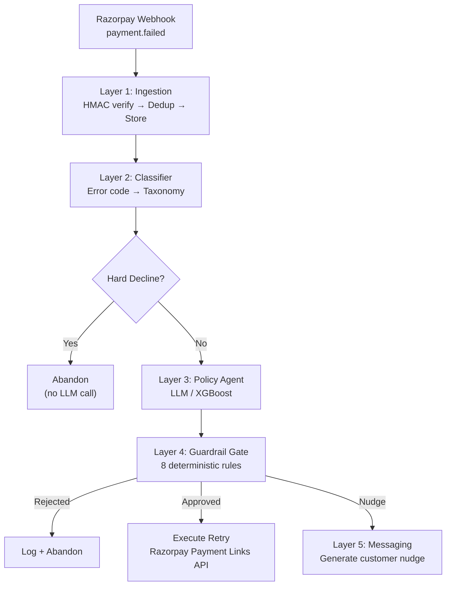

# 🔄 Payment Failure Recovery Engine

> AI-powered system that decides **whether**, **when**, and **on which rail** to retry a failed payment — with deterministic guardrails ensuring no LLM ever directly authorizes money movement.

Indian checkout success rates sit in the high 80s. Every failed payment is real, recoverable money. This system replaces dumb fixed-schedule retries with intelligent, context-aware recovery decisions — and **proves the improvement with numbers, not vibes.**

## 📊 Headline Result

```
Run: python -m eval.runner --scenarios 5000 --seeds 5 --skip-llm
```

5,000 scenarios × 5 seeds (mean ± σ). These are the exact contents of
`eval/results/` — reproduce them with the command above.

| Policy | Recovery Rate | Retry Cost (avg) | False-Retry % | ₹ per ₹1Cr Failed |
|--------|-------------|-------------------|---------------|---------------------|
| No Retry | 0.0% | 0.00 | 0.0% | ₹0 |
| Fixed 3-Retry | 73.5% ± 0.5 | 1.88 ± 0.01 | 8.0% ± 0.3 | ₹72,36,492 |
| XGBoost/Rules | 72.8% ± 0.4 | 1.61 ± 0.01 | 0.0% ± 0.0 | ₹72,56,487 |
| LLM Agent | not yet run | — | — | — |

**The comparison above cannot resolve a sub-1pp difference, so don't read one
into it.** 73.5% vs 72.8% with σ ≈ 0.5 is two overlapping intervals. To actually
answer "is the agent better," the harness runs every policy under **common
random numbers** — the same scenario draws the identical random sequence
regardless of which policy is deciding — and differences outcomes one-to-one:

| vs. Fixed 3-Retry | Δ | 95% CI | n | Real? |
|---|---|---|---|---|
| Recovery rate | −0.67pp | [−1.35, +0.01] | 25,000 | **no — inside noise** |
| Retry attempts | −0.262 | [−0.273, −0.251] | 25,000 | **yes** |

**The honest claim: no measurable recovery difference, and a statistically
significant 14% reduction in retry attempts (1.61 vs 1.88), at zero false
retries vs 8%.** The agent never retries a hard decline, a fraud block, or an
expired instrument. That is a cost win, not a recovery win, and it is stated
that way deliberately.

Three known gaps, named rather than hidden:

1. **The headline metric doesn't price a retry.** Recovery rate alone makes
   brute force optimal by construction, so selectivity cannot show up as a win
   until retry attempts carry their real cost — gateway fees, decline-ratio
   penalties, customer goodwill. See `docs/eval_methodology.md`.
2. **73% blended recovery is higher than the real world.** Published recovery
   rates for failed payments sit closer to 15–30%. The bank simulator is
   currently too generous on retry success. This is a calibration gap, not a
   result.
3. **The LLM policy has no recorded run.** That row is blank because it has not
   been run end-to-end, not because it scored badly.

No number in this README was written by hand; every one comes from
`eval/runner.py`.

## 🏗️ Architecture

```
Layer 1: Ingestion          → Signature verify → Idempotency → Event store
Layer 2: Deterministic      → Error code → Failure taxonomy (NO LLM)
Layer 3: Policy Agent       → LLM/XGBoost → Constrained JSON action
Layer 4: Guardrail Gate     → Schema + Business rules → BEFORE execution
Layer 5: Recovery Messaging → Customer nudge (scoped LLM generation)
```



**Order matters:** Deterministic logic wraps the LLM on **both sides**. The model only ever chooses from a constrained action space and never executes anything directly.

## 🛡️ What Stops It From Doing Something Stupid With Real Money

This is the first question a fintech panel will ask. Here's the answer:

1. **Hard-decline blocklist** — Fraud blocks, stolen cards, and permanent declines are caught *before* the LLM is ever called. No agent involvement.
2. **Fixed action space** — The LLM outputs a JSON action from exactly 5 options: `retry_now`, `retry_at`, `switch_rail`, `nudge_customer`, `abandon`. No freeform.
3. **Schema validation** — Pydantic validates every agent output. Malformed JSON → auto-reject.
4. **8 business rules** — Max retries per payment (3), per customer per 24h (5), amount ceiling (₹50K), consent window (72h), nudge rate limit (2/day), time-of-day blackout (11PM-7AM), idempotency key requirement.
5. **Idempotency keys** — The key is deterministic (`retry_{payment_id}_{attempt_no}`) and
   `retry_attempts.idempotency_key` is UNIQUE. The orchestrator checks for an existing
   attempt *before* calling the Razorpay API, so a replayed webhook cannot produce a
   second payment link. Note the honest boundary: `razorpay-python` has no idempotency
   header, so this is enforced on our side, not the gateway's.
6. **No short-circuiting** — The guardrail checks ALL rules and reports ALL violations for audit.
7. **LLM fallback** — If the LLM fails, times out, or returns garbage, the system falls back to an XGBoost rule-based heuristic. Never blocks.

## 🚀 Quick Start

### Without Docker
```bash
# Clone and install
git clone <repo-url> && cd payment-recovery-engine
pip install -e ".[dev]"

# Configure
cp .env.example .env
# Edit .env with your Razorpay test-mode keys and LLM API key

# Start Postgres (or use Docker just for the DB)
docker run -d --name recovery-pg -p 5432:5432 \
  -e POSTGRES_DB=payment_recovery \
  -e POSTGRES_USER=recovery \
  -e POSTGRES_PASSWORD=recovery \
  postgres:15-alpine

# Run the API
uvicorn src.main:app --reload

# Run the dashboard (separate terminal)
streamlit run dashboard/app.py
```

### With Docker Compose
```bash
cp .env.example .env  # fill in your keys
docker compose up
```

## 📈 Run the Eval Harness

```bash
# Fast mode — no API keys needed, uses XGBoost/rule-based policies
python -m eval.runner --scenarios 5000 --seeds 5 --skip-llm

# Full mode — includes LLM policy (requires ANTHROPIC_API_KEY)
python -m eval.runner --scenarios 5000 --seeds 5

# Train XGBoost baseline
python scripts/train_xgboost.py --n-samples 10000

# Simulate webhooks
python scripts/simulate_webhooks.py --count 20
```

## 📁 Project Structure

```
├── src/
│   ├── ingestion/        # Layer 1: Webhook endpoint + signature + dedup
│   ├── classifier/       # Layer 2: Error code → failure taxonomy
│   ├── agent/            # Layer 3: LLM policy agent + XGBoost baseline
│   ├── guardrail/        # Layer 4: Schema + business rule validation
│   ├── messaging/        # Layer 5: Customer nudge generation
│   ├── executor/         # Retry execution via Razorpay API
│   ├── orchestrator.py   # Ties all 5 layers together
│   └── main.py           # FastAPI app
├── eval/                 # Standalone eval harness
│   ├── simulator.py      # Bank-response simulator
│   ├── scenario_generator.py
│   ├── policies/         # No-retry, fixed-retry, XGBoost, LLM
│   └── runner.py         # Runs all policies, produces results table
├── dashboard/            # Streamlit dashboard
├── tests/                # Pytest test suite
├── scripts/              # Utility scripts
└── docs/                 # Architecture, failure cases, eval methodology
```

## ⚠️ Documented Failure Cases

See [docs/failure_cases.md](docs/failure_cases.md) for the full list. Summary:

| # | Failure Case | System Response |
|---|-------------|-----------------|
| 1 | LLM hallucination | Guardrail rejects, falls back to abandon |
| 2 | Bank API timeout | Deterministic key + pre-execute check prevents duplicate link |
| 3 | Consent window expired | Guardrail rejects retry after 72h |
| 4 | Rate limit exhaustion | Abandon silently, log for review |
| 5 | Cascade failure | Max retry cap prevents infinite loop |
| 6 | LLM provider outage | XGBoost fallback (degradation not yet measured) |
| 7 | Simulator vs reality | Stated as known limitation |

## 🔧 Tech Stack

- **Python 3.11+** / FastAPI / SQLAlchemy (async)
- **PostgreSQL** — events, failures, retries, ledger
- **Claude / GPT** — policy agent + nudge generation
- **XGBoost** — ML baseline for comparison
- **Streamlit + Plotly** — dashboard
- **Razorpay API** — test-mode webhooks + Payment Links
