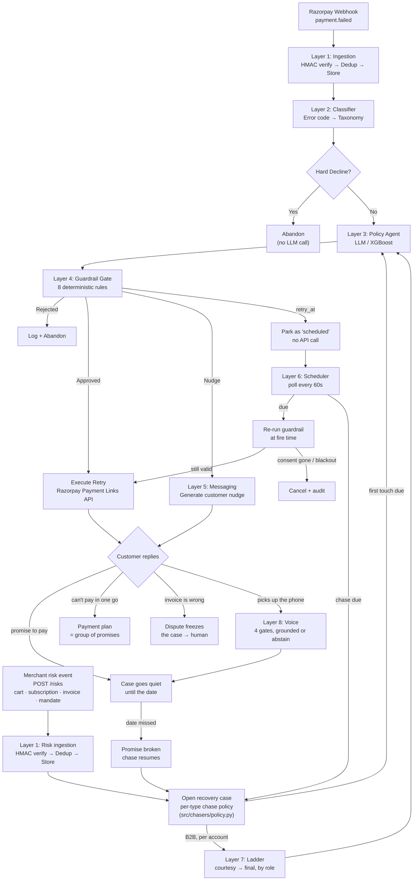

# 🔄 Payment Failure Recovery Engine

[](https://github.com/jitheender-ops/payment-recovery-engine/actions/workflows/ci.yml)


> AI-powered system that decides **whether**, **when**, and **on which rail** to retry a failed payment — with deterministic guardrails ensuring no LLM ever directly authorizes money movement.

Indian checkout success rates sit in the high 80s. Every failed payment is real, recoverable money. This system replaces dumb fixed-schedule retries with intelligent, context-aware recovery decisions — and **proves the improvement with numbers, not vibes.**

```
Razorpay webhook ──▶ classify ──▶ decide (LLM / XGBoost) ──▶ guardrail ──▶ execute
                      │ no LLM      │ constrained JSON        │ 12 rules     │ Payment Link
                      ▼             ▼                         ▼              ▼
                 hard declines   5 fixed actions          ALL violations   idempotent,
                 never reach it                           reported         audited, bounded
```

Sending the link is the easy half. The engine also **listens to the reply** —
a Hinglish voice call, a promise to pay, an instalment plan, a disputed
invoice — and a B2B buyer is escalated by person rather than by volume:

```
customer replies ──▶ promise ──▶ the case goes quiet until that date, and
                 │                  where they authorise UPI Autopay it
                 │                  COLLECTS ITSELF on that date
                 ├─▶ plan    ──▶ instalments, each its own promise
                 ├─▶ dispute ──▶ case frozen, escalated to a human
                 └─▶ voice   ──▶ grounded answer, or an honest "I don't know"
```

A promise used to be a deferral plus a reminder plus a link — whether the
money arrived was up to the customer remembering. Where they authorise a
**UPI Autopay mandate**, the scheduler debits it on the date they named,
inside RBI's e-mandate rules: a 24-hour pre-debit notice is enforced by the
guardrail, and above the ₹15,000 authentication-exempt ceiling the option is
never offered at all, because an unattended debit is not lawful there. Off by
default (`PROMISE_MANDATE_ENABLED`) until Razorpay Recurring Payments is
enabled on the account.

## 📊 Headline Result

```
Run: .venv/bin/python -m eval.runner --scenarios 5000 --seeds 5 --llm-concurrency 30
```

> **₹11.71L additional net revenue per ₹1Cr of failed volume vs. a fixed 3-retry
> baseline, at 15% fewer retry attempts and zero false retries — from XGBoost,
> which beats the LLM Agent too.**

5,000 scenarios × 5 seeds (mean ± σ). These are the exact contents of
`eval/results/` — reproduce them with the command above (needs an
OpenAI-compatible `LLM_BASE_URL`; see `eval/modal_llm_server.py` for a
self-hosted one sized for full-scale runs).

Every number here is drawn from the **`legacy` failure mix** — the failure
population as India produced it before authorization-time models started
suppressing the easy half. `--mix vulcan` runs the same harness against a
harder, hypothesised population; see [Run the Eval Harness](#-run-the-eval-harness).

| Policy | Recovery Rate | Retry Cost (avg) | False-Retry % | ₹ per ₹1Cr | Net ₹ per ₹1Cr |
|--------|-------------|-------------------|---------------|------------|----------------|
| No Retry | 0.0% | 0.00 | 0.0% | ₹0 | ₹0 |
| Fixed 3-Retry | 19.2% ± 0.7 | 2.73 ± 0.01 | 8.0% ± 0.3 | ₹18,49,489 | ₹17,95,744 |
| XGBoost | 30.2% ± 0.5 | 2.32 ± 0.00 | 0.0% ± 0.0 | ₹30,11,938 | ₹29,66,249 |
| LLM Agent | 26.6% ± 0.5 | 2.38 ± 0.01 | 0.0% ± 0.0 | ₹26,44,430 | ₹25,97,603 |

**This row moved.** It previously read 27.4% and was labelled "XGBoost/Rules",
because `XGBoostPolicy.decide()` loaded a trained model into `self._model` and
then never referenced it — every decision took the rule branch, and no
production call site passed a model path at all. The model is consulted now
(`scripts/train_xgboost.py` builds it, `run.sh` trains one if missing), and it
disagrees with the rules often enough to be worth 2.8pp.

**The LLM Agent row is filled in now, and it loses.** Earlier revisions of this
README showed it blocked (the configured provider had no API credits) — see
git history if you want that story. Run at full scale against a self-hosted
Qwen2.5-7B-Instruct (`eval/modal_llm_server.py`), it beats Fixed 3-Retry but
**trails XGBoost on both recovery (26.6% vs 30.2%) and net revenue**. It's also
the more expensive policy to run in practice: the ₹ figures above price only
retry/gateway attempts, the same as every other row — they do not include the
LLM's own inference cost, which is zero for XGBoost and non-zero for this row.
Nothing in this eval justifies choosing the LLM Agent over XGBoost for this
task; it's kept in the harness as the interesting negative result and as
scaffolding for a policy where free-text reasoning earns its cost.

### Is that difference real?

Two overlapping ± ranges can't answer that, so the harness doesn't try. Every
policy runs under **common random numbers** — the same scenario draws the
identical random sequence no matter which policy is deciding — and outcomes are
differenced one-to-one, giving a confidence interval on the *difference*:

| Policy | Metric | Δ vs. Fixed 3-Retry | 95% CI | n | Real? |
|---|---|---|---|---|---|
| XGBoost | Recovery rate | **+11.03pp** | [+10.54, +11.52] | 25,000 | **yes** |
| XGBoost | Retry attempts | **−0.409** | [−0.421, −0.397] | 25,000 | **yes** |
| LLM Agent | Recovery rate | **+7.34pp** | [+6.90, +7.78] | 25,000 | **yes** |
| LLM Agent | Retry attempts | **−0.351** | [−0.363, −0.340] | 25,000 | **yes** |

Both real, and XGBoost's is bigger — it's not just cheaper than the LLM Agent,
it's the more effective policy, full stop.

### Why net, and why you don't have to trust our cost number

Recovery rate alone makes brute force optimal by construction — if attempts are
free, "retry everything, always" wins. So the headline is **net of retry cost**,
defaulting to ₹2.00/attempt (`--retry-cost-inr` to change it).

That default is a floor: it prices gateway and ops cost only, not decline-ratio
penalties or customer goodwill, neither of which we can source honestly. So the
harness also reports the **break-even** — the retry cost at which a policy and
Fixed 3-Retry would tie. Both XGBoost and the LLM Agent recover *more* while
attempting *fewer*, so both **dominate Fixed 3-Retry at any retry cost including
₹0** — that comparison isn't in question. What the break-even framing doesn't
cover is XGBoost vs. the LLM Agent directly: XGBoost wins that one outright, on
every axis measured, before even counting the inference cost the LLM Agent
doesn't have to pay under this accounting.

### What the model assumes

The bank simulator is synthetic — stated plainly, because it's the number a
payments person will challenge first. Its central assumption: **a retry is not a
fresh payment.** The payment already failed for a reason, so the bank's baseline
approval rate says little; what matters is `P(the blocker cleared)`, which is
modelled per failure class in `eval/bank_profiles.py`. Blended baseline recovery
lands at 19.2%, inside the 15–30% band public figures report, and
`tests/test_calibration.py` fails if a change pushes it out.

**Why the LLM Agent row can be trusted:** the harness refuses to fill it in
dishonestly. `PolicyAgent.decide()` swallows LLM errors and returns a
heuristic action, so a dead provider would otherwise produce a full, plausible
LLM row made entirely of XGBoost fallbacks. The runner counts those
(`fallback_count`) and drops the row when they dominate — an earlier revision
of this README shipped with the row blank for exactly that reason (the
configured provider had no API credits). The run behind the current numbers
used a self-hosted Qwen2.5-7B-Instruct on Modal (`eval/modal_llm_server.py`)
instead, specifically because free-tier providers cap out far below the ~6M
tokens a full 5000×5 run needs — so this row is measuring the LLM, not the
fallback.

**On the XGBoost model's near-perfect held-out score:** the training labels are
the argmax of the simulator's own expected-value calculation, which is a
deterministic function of the same features. A tree fits that closely, so ~0.99
means "it learned the simulator", not "this is a hard prediction problem". It is
still a genuine baseline — it encodes bank/hour/blocker-clearing structure the
rule heuristic does not — but the score is not evidence of difficulty.

No number in this README was written by hand; every one comes from
`eval/runner.py`.

## 🏗️ Architecture

```
Layer 1: Ingestion          → Signature verify → Idempotency → Event store
                              (Razorpay webhooks AND merchant-pushed /risks)
Layer 2: Deterministic      → Error code → Failure taxonomy (NO LLM)
Layer 3: Policy Agent       → LLM/XGBoost → Constrained JSON action
Layer 4: Guardrail Gate     → Schema + 11 business rules → BEFORE execution
Layer 5: Recovery Messaging → Customer nudge (scoped LLM generation)
Layer 6: Scheduler          → 14 sweeps on one tick: fire deferred retries,
                              reconcile dropped events / risk events / stale
                              write-aheads, cancel dead and superseded links,
                              expire and remind promises, reconcile plans,
                              consolidate B2B accounts, chase due cases,
                              deliver merchant alerts
Layer 7: Receivables        → B2B dunning ladder, aging, disputes, payment
                              plans, statements, merchant writeback
Layer 8: Voice              → Hinglish call handling, 4 gates, promise capture
```

**Layers 7 and 8 are where the reply is handled.** Everything above them is
outbound: decide, gate, send. The receivables layer escalates a company buyer
through five rungs by *role* (accounts payable → finance manager → escalation
contact) and consolidates every overdue invoice for one buyer into a single
contact per rung. The voice layer answers what the customer asks about their
own case, grounded in that case's facts, and abstains rather than inventing.



**The four chasers extend the same pipeline to money that never reached a
gateway.** A card decline announces itself; an abandoned cart, a halted
subscription, an overdue invoice and a failed mandate debit only exist in the
merchant's own systems. The merchant POSTs them to `POST /risks`
(HMAC-signed with `RISK_WEBHOOK_SECRET`, deduped into `risk_events`, processed
in the background), and the engine opens a recovery case and chases it through
the exact same agent → guardrail → payment-link machinery. Per-type chase
bounds live in `src/chasers/policy.py` — attempt budgets, consent windows
(48h for a cold cart, 30 days for a receivable), first-touch delays and the
recommended rail. `payment_failure` is deliberately NOT a chaser type: it
stays webhook-driven, and the chase sweep never touches it.

**Overdue invoices get a second layer on top.** A B2B buyer is not one case —
it is an *account* with several overdue invoices and several people who could
pay them. `chase_due_accounts` runs before the per-case sweep, picks one
carrier case per account, defers every other joiner, and leaves the carrier due
so the per-case sweep delivers the rung's single contact. That order is a
correctness property, not a preference: run it the other way and all three
guarantees break at once — the buyer is contacted once per invoice, the Mon–Fri
09:30–18:30 IST window is skipped (only this sweep enforces it), and
consolidation then finds nothing due, so the ladder never fires.

**`retry_at` is the branch worth reading twice.** The executor maps `retry_at`
onto the same `_create_payment_link` call as `retry_now`, so before Layer 6
existed, "retry in 4 hours" created the link *immediately* and
`retry_attempts.scheduled_at` was written and read by nothing. A guardrail that
approves "not yet" in front of a system that does it now is worse than having no
timing at all, because the audit trail then records a delay that never happened.

**Order matters:** Deterministic logic wraps the LLM on **both sides**. The model only ever chooses from a constrained action space and never executes anything directly.

## 🛡️ What Stops It From Doing Something Stupid With Real Money

This is the first question a fintech panel will ask. Here's the answer:

1. **Hard-decline blocklist** — Fraud blocks, stolen cards, and permanent declines are caught *before* the LLM is ever called. No agent involvement.
2. **Fixed action space** — The LLM outputs a JSON action from exactly 5 options: `retry_now`, `retry_at`, `switch_rail`, `nudge_customer`, `abandon`. No freeform.
3. **Schema validation** — Pydantic validates every agent output. Malformed JSON → auto-reject.
4. **12 business rules + schema** — Max retries per payment (3), per customer per rolling 24h (5), amount ceiling (₹50K), consent window (72h), `retry_at` inside that window, nudge rate limit (2/day), time-of-day blackout (11PM-7AM IST, computed on a true Asia/Kolkata clock), idempotency key requirement, an expected-value stopping rule, the hard-decline blocklist, a switch-only rule (a class the gateway refused on *this instrument* may not be retried on the same rail), and the RBI e-mandate pre-debit notice.
5. **Idempotency keys** — The key is deterministic (`retry_{payment_id}_{attempt_no}`) and
   `retry_attempts.idempotency_key` is UNIQUE. The orchestrator checks for an existing
   attempt *before* calling the Razorpay API, so a replayed webhook cannot produce a
   second payment link. Note the honest boundary: `razorpay-python` has no idempotency
   header, so this is enforced on our side, not the gateway's.
6. **No short-circuiting** — The guardrail checks ALL rules and reports ALL violations for audit.
7. **LLM fallback** — If the LLM fails, times out, or returns garbage, the system falls back to XGBoost. Never blocks. `fallback_count` is what makes this real: `PolicyAgent.decide()` swallows provider errors and returns its own conservative heuristic without raising, so for a while the XGBoost branch was unreachable and a missing API key silently abandoned ~70% of recoverable payments. The orchestrator now compares that counter across the call and discards a degraded answer.
8. **Deferred retries re-validate at fire time** — A `retry_at` decision outlives its own guardrail check by hours. When the scheduler fires it, the case state, the consent status and the time-of-day blackout are all re-read; a customer who opted out at 23:00 does not get the 02:00 retry that was approved at 22:00.
9. **The idempotency race fails closed** — Two webhooks for one payment can both derive the same key before either commits. The UNIQUE constraint on `retry_attempts.idempotency_key` breaks the tie *before* the Razorpay call, and the loser exits as a clean skip rather than an unhandled exception.
10. **Rate limits that actually roll** — The per-customer tallies decay on a true 24-hour window (reads and writes apply the same rule), so "5 retries per 24h" cannot silently become a lifetime ban. And a guardrail veto counts against the *case*, never against the customer's contact quota — a rejected action contacted nobody.
11. **Deferred retries are clamped out of the blackout before they're parked** — A deferral approved at 22:30 that lands at 23:05 would pass decision-time validation and die at fire-time re-validation, having already spent an attempt slot. It is shifted forward to the window's edge instead — forward-only, because waiting longer is always compliant.
12. **Write-ahead attempts can't get lost in flight** — Every execution is committed as `pending` *before* Razorpay is called. If the process dies mid-call, a scheduler sweep resolves the stale row to failed-outcome-unknown after a threshold: the slot stays spent (fail-closed), but nothing sits "in flight" forever, and a later capture still attributes through the idempotency-key breadcrumb.
13. **An open dispute freezes the case** — A customer who says "this invoice is wrong" has raised a question no chaser can answer. The case stops dead and surfaces on the merchant's worklist; nothing automated touches it until a human resolves the dispute. Arguing about an invoice is how a customer is lost, not recovered.
14. **A mandate debit without a pre-debit notice is downgraded, not sent** — The RBI Digital Payments E-mandate Framework requires ≥24h notice before an auto-debit. If no notice has gone out, the collection is turned into the notice instead of being attempted. This covers both things that move money against a standing instruction: a merchant-reported mandate retry, and the promise-backed UPI Autopay debit on any risk type. For the second, the 48h pre-due promise reminder *is* that notice.
15. **A promise-backed debit is authorised for one amount on one date** — The mandate is registered for the promise's own amount and expires a day after it. A mandate authorised for more, or for longer, is consent the customer did not give. Only the gateway's own token status can arm it: an unreadable or failed lookup leaves it pending and unchargeable, because consent must never be inferred from a network error.
16. **The order id is committed before the debit is presented** — It is the only join key a mandate capture carries. Recording it afterwards meant a timeout on the charge left an attempt with no order id, and if the money had moved the capture would quote an id nothing in the database had seen. Same law as the write-ahead row, one level down.
17. **The voice agent abstains rather than invents** — Four gates: opt-out honoured first, a retrieval floor below which it says it does not know, sanitation of instructions hiding in retrieved text, and a grounding check the answer must pass against its cited passage. A confident invented number on a call about money is worse than no answer.
16. **Bounded contact for B2B buyers** — One contact per account per rung. A buyer with four overdue invoices gets one consolidated statement, not four messages, and the ladder escalates by *role* rather than by volume.

## 🚀 Quick Start

### Just show me it working (no account, no Docker, no internet)

```bash
./run.sh --demo
```

Then open **one page — `http://127.0.0.1:8000/demo`**. Every capability, the
B2B account statements, the merchant console and the analytics dashboard are
all linked from it.

No `.env`, no Razorpay account, no Postgres, no tunnel. It runs the same verification the normal path does, then starts the
engine against a SQLite file with the payment gateway replaced by a local
fake (`src/demo.py`), seeds a few dozen realistic cases, and prints every URL
worth opening — one per customer-page state, the B2B account statement, and
the merchant console with its password.

The point is that it is not a mock-up. The **whole loop runs for real**: open
a payable link, press Pay, pay on the demo checkout, and that page sends a
genuinely HMAC-signed `payment.captured` to the real webhook endpoint, which
verifies the signature, stores the event, and attributes the money through
the same code production uses. The page comes back reading *recovered* with
a receipt, and the console's recovered figure moves.

What is faked is exactly one object — the Razorpay SDK client. Demo mode
**cannot** run with `APP_ENV` set to anything but `development`; Settings
refuses to construct. A fake gateway that always succeeds looks like a
healthy business from every downstream signal, so it must never be able to
run where someone would believe it.

Reset with `rm .demo.sqlite3 .demo.seeded`.

### The real thing

```bash
cp .env.example .env    # fill in your Razorpay test keys + LLM key
./run.sh
```

That is the whole thing. `run.sh` builds a clean isolated venv, installs
dependencies, creates the Postgres role and database if they don't exist, runs
`ruff` + `pytest` + `mypy --strict`, starts the API and the dashboard, and opens
a public tunnel — then prints the webhook URL to paste into Razorpay:

```
  API          http://127.0.0.1:8000
  API docs     http://127.0.0.1:8000/docs
  Dashboard    http://127.0.0.1:8501  (password from .env)
  Public URL   https://<random>.trycloudflare.com

  Paste this into the Razorpay dashboard → Settings → Webhooks:
    https://<random>.trycloudflare.com/webhooks/razorpay
```

It refuses to expose anything until the three checks pass, so a green public URL
means the build is actually clean. Ctrl-C stops everything.

**Two things are gated, because the tunnel is public:**

- **The dashboard** needs `DASHBOARD_PASSWORD`. Leave it blank and `run.sh`
  generates one into `.env` and prints it once. It reads live payment data, and
  Streamlit binds a port like anything else.
- **`/docs`, `/redoc` and `/openapi.json`** exist only when
  `APP_ENV=development` — they enumerate every route and schema. Set
  `APP_ENV=staging` and `API_KEY` to close them; `/openapi.json` then needs
  `X-API-Key`. `run.sh` warns if you leave them open under a live tunnel.

| | |
|---|---|
| `./run.sh --demo` | everything, offline: SQLite, fake gateway, seeded, no credentials |
| `./run.sh --demo --scale` | the same with ~2,500 cases, for the batch-recovery story |
| `./run.sh --sandbox` | the real Razorpay test API on a local SQLite database; add `--tunnel` to close the webhook loop |
| `./run.sh --verify-only` | build + all three checks, start nothing (needs no Postgres) |
| `./run.sh --no-tunnel` | run locally without a public URL |
| `PY=python3.12 ./run.sh` | pin the interpreter, when `python3` isn't the one with working wheels |

### CI

`.github/workflows/ci.yml` runs `ruff` + `mypy --strict` + `pytest` on Python
3.11 and 3.13 (the floor `pyproject.toml` claims and the ceiling it is developed
on), applies every Alembic migration over a `create_all` schema to catch the
drift `create_all` hides, and separately trains the model and runs the eval
harness so the numbers above cannot quietly stop reproducing. The suite itself
needs no database service — `tests/conftest.py` builds the real schema over a
throwaway SQLite file, which is the same reason `--verify-only` needs no
Postgres. The migration job is the one exception: it runs the chain check twice,
once on SQLite and once against a `postgres:16` service container, because the
SQLite-only run passed two migrations that then died on the first deploy.

**Requirements:** Python ≥ 3.11, Postgres (`brew services start postgresql@15`
or `docker compose up -d postgres`), and `cloudflared` or `ngrok` for the public
URL. Everything else the script installs itself.

**On the venv:** the build is isolated on purpose — no `--system-site-packages`.
The script verifies this by checking that imports resolve to files *inside*
`.venv`, not merely that they import. A venv built with system site-packages
passes a plain `import fastapi` while owning nothing, so `pip freeze` writes a
lockfile of packages it doesn't have and a clean machine gets `ImportError` at
startup. If it finds such a venv it rebuilds it, and restores the old one if the
rebuild can't reach PyPI.

**On the lockfile:** the first successful build writes `requirements.lock.txt`
from what actually installed, and later builds install from it. Commit it — the
pins are then the exact versions the checks passed against, rather than guesses.

### With Docker Compose

```bash
cp .env.example .env    # fill in your keys, incl. POSTGRES_PASSWORD
docker compose up
```

Compose has no public tunnel and no verify step — it's the plain local stack.
Note it does **not** publish Postgres' port: the app reaches it over the compose
network, because binding 5432 to `0.0.0.0` would expose a database holding
customer emails, phone numbers and VPAs to the whole local network.

## 👀 See it work

Three commands. No LLM key needed — the engine runs on the trained XGBoost
policy, which is the better-scoring one anyway.

```bash
./run.sh                                  # 1. builds, verifies, migrates, starts everything
python scripts/simulate_webhooks.py --count 24    # 2. drives it with synthetic traffic
# 3. open the dashboard URL run.sh prints, password from .env
```

Step 2 runs both halves of the loop:

**Phase 1 — `payment.failed`.** Each webhook is signature-checked, deduped,
classified, and opens a recovery case. Hard declines (fraud, stolen card) are
abandoned before the agent is ever called. Everything else gets a decision from
the fixed five-action space, a guardrail check, and an attempt written *ahead*
of the Razorpay call.

**Phase 2 — `payment.captured`.** This is the half that was missing, and
without it nothing could ever be shown to work: cases opened and stayed open,
`amount_recovered` was 0 forever. A recovered payment carries an id we have
never seen, so the capture is matched back through the breadcrumb the executor
wrote into the link's notes. A slice of captures deliberately carries only an
`order_id` — that is the customer paying on their own, which counts as revenue
but is **not** credited to the engine.

It prints what actually happened:

```
  Failures ingested              70
  Cases opened                   48
  Cases recovered                13
  Attempts made                  70   (7 scheduled for later)

  Money at risk              ₹3.11L
  Money recovered            ₹38.5K
  ...attributed to us        ₹36.2K   <- the honest number
  ...customer self-paid       ₹2.3K

  Agent decisions:
    abandon                43
    retry_at               12
    switch_rail            10
    nudge_customer          5
```

`retry_at` decisions do not fire immediately — they are parked as `scheduled`
and the Layer 6 scheduler executes them when due, re-running the guardrail at
that point. To watch one fire without waiting, drop the interval:

```bash
SCHEDULER_INTERVAL_SECONDS=10 ./run.sh
```

**The four chasers** run the same loop for money that never reached a gateway —
abandoned carts, halted subscriptions, overdue invoices, failed mandate debits.
They arrive as merchant-pushed risk events instead of webhooks:

```bash
python scripts/run_risk_batch.py --count 24
```

Phase 1 posts HMAC-signed events to `/risks`; subscriptions and invoices are
chased at once, carts and mandates defer their first touch per policy and are
picked up by the scheduler's chase sweep. Phase 2 captures on the chase links
and prints the per-type recovery table.

**Where to look afterwards:** the dashboard's Overview shows the recovery ledger
band — brass is money a link *we* sent brought back, hatched is the customer
paying anyway, and the remainder is still open. `case_events` is the audit
trail: every open, escalation, deferral, attribution and close, with the actor
that did it.

```sql
SELECT event_type, actor, detail FROM case_events ORDER BY id DESC LIMIT 20;
```

**Check the LLM before spending quota** — the engine falls back to XGBoost when
the provider is unusable, and `fallback_count` makes that degradation visible
rather than silent:

```bash
python scripts/check_llm.py
```

### 🖥️ The operations console

The Streamlit dashboard is an ops console, not a demo: every number on it is a
query over the real tables, and when there is no data it says so instead of
drawing something plausible. Six views:

| View | Answers |
|---|---|
| **Overview** | Money at risk vs. money back — the recovery ledger band separates what *our* links earned from customers who paid anyway |
| **Recovery funnel** | Where the pipeline leaks: payments and attempts as two separate funnels, plus failure classes ranked |
| **Banks & rails** | Recovery rate per bank × rail heatmap, money recovered per bank, success by hour with the IST blackout drawn where it bites |
| **Policy eval** | The eval table above, live from `eval/results/` — net revenue leads, paired CIs answer "is it real" |
| **Cases & audit** | Every case by state; pick one and unfold its full `case_events` timeline — actor, action, reason, in order |
| **Operations** | Is the machinery running: scheduled/pending/stale retries, unprocessed events, guardrail vetoes with reasons, decision mix, ledger health |

All timestamps render in IST (the timezone the blackout itself runs on), the
sidebar shows a live database-status chip, and **Refresh data** busts the 30s
query cache. The gate is fail-closed: no `DASHBOARD_PASSWORD`, no dashboard.

### 🧠 The model page (`/model`)

A page about the decision layer rather than the product: the fifteen failure
classes grouped by the lever that moves each one, the five actions that are the
only thing representable, the twelve rules that re-check the chosen one, and
what the harness measured against a fixed-3-retry baseline. It is a scroll
narrative — the mechanism act pins and the payment's position on the pipeline
*is* your scroll position — and it is the one page in this repo that loads an
animation library, deliberately and only there.

Every claim on it is rendered from the enforcing structure: the classes from
`FailureClass`, the actions from the `ActionType` Literal, the rules from
`GuardrailRules`, the figures from `eval/results/eval_results.json` at render
time. Copy cannot drift from the code, and `tests/test_merchant_console.py`
asserts the page against those sources rather than against typed-in literals.
With no eval results on disk the results act omits itself entirely — a page
about measurement does not get to show a remembered number.

The animation is never load-bearing. Every layout is authored as its final
readable state and the pinned variant lives behind a class JS adds only after
GSAP is confirmed, so a blocked CDN, `prefers-reduced-motion`, or a phone
gets eight plain stacked sections with every word intact.

### 💼 The merchant console

Separate from the ops dashboard and built for a different reader: the merchant
whose revenue is leaking, not the operator debugging the machinery. One public
page, ten gated ones, all served by the API itself.

| Route | Who | What |
|---|---|---|
| `GET /console` | public | Product facts only — the five leaks with their enforced bounds, what happens when the customer replies, what the engine refuses to do, and how to feed it. Touches no database, shows no live number, safe on a public deployment |
| `GET /console/live` | `DASHBOARD_PASSWORD` | The live ledger, aggregate and PII-free |
| `GET /console/accounts` | gated | The buyer directory: who owes you, ranked, and which contact roles are on file. An account with nobody on file says so — a rung that escalates to a role nobody recorded escalates to nobody |
| `GET /console/account/{id}` | gated | One buyer: contacts by role, open invoices, and what was actually sent per rung. Addresses are masked (`a…p@buyer.in`) |
| `GET /console/messages` | gated | Every message the engine sends, rendered by the sender's own functions. Not a copy — a preview that could drift from what ships is worse than none |
| `GET /console/customer` | gated | The other side of every case: the page the customer was handed, whether they opened it, and what they did from it. Lists no links — see below |
| `POST /console/customer/open` | gated | Mints one fresh hour-long recovery link for one case and opens the real page with it |
| `GET /console/pipeline` | gated | The funnel, and where the money leaves it |
| `GET /console/routing` | gated | Which bank clears on which rail |
| `GET /console/cases` | gated | Every unit of revenue at risk, filterable by state |
| `GET /console/batch` | gated | Preview a cohort, approve it, execute it, measure it |
| `GET /console/ops` | gated | Is the machinery running — sweeps, heartbeat, and whether the audit hash chain still verifies |
| `GET /console/evidence` | gated | Does the agent beat the baseline, with paired CIs |

**The console had the engine's side of every case and not the customer's.**
It could say which guardrail approved an action, on which rail, with what
confidence — and could not show the page the person on the other end was
actually handed. `/console/customer` is that half: per case, whether the
customer opened their page, whether they promised, disputed or opted out, and
a button that opens the real page rather than a second rendering of it (a copy
would drift the week after it shipped, and the drift would be invisible from
here).

It prints no links. A `/recover/<token>` URL **is** the credential — whoever
holds it can view and pay that case — so a table of them would be a table of
live credentials sitting in a browser cache and in every screenshot of the
page. The button mints one for a single case, valid an hour instead of the
usual day. And because the console's session cookie is scoped to `/console`
precisely so a customer page can never carry operator authority, that cookie
cannot tell the customer page who is looking: the button leaves a signed,
ten-minute, single-case marker that labels the resulting `page_viewed` row
`operator`. Without that split, every operator preview would have landed in
the nudge click-through figure `contact_effectiveness()` publishes — a metric
claiming "they opened it" about a page only staff had opened.

**Every action the console names, it can perform.** That was not always true:
the disputes panel said *"chasing is frozen until you uphold or reject"* with no
control, the ladder showed a bare count of call tasks, and the page displayed
outstanding balances it had no way to let anyone close. Uphold/reject, close a
call task, and record money that arrived by NEFT or cheque are all forms on the
page now, posting to handlers that previously existed only as HMAC-signed JSON
a person on a laptop could not reach.

The live page is ordered by the questions a merchant actually asks, in order:

1. **Is the engine running?** — a heartbeat strip above everything, because a
   stale scheduler makes every figure below it a frozen snapshot. It says
   *Engine stopped* out loud rather than leaving you to infer it from numbers
   that quietly stopped changing.
2. **How much is still out there?** — *Still owed* is the **balance**
   (at-risk minus what has come in), not the opening figure, so a book with
   heavy part-payment does not read as if nothing had been collected.
   *Brought back* separates what our links earned from what arrived anyway.
3. **What needs me?** — the worklist, and the spine of the page. Automation
   here is bounded by design, so the things it **refused** — a frozen dispute,
   a case out of attempts, a voice call stuck in the queue — are the page's
   most important content, not a footnote. An empty worklist is a real answer
   and gets said out loud.
4. **How is the chase going?** — the B2B ladder drawn as a ladder, promises
   kept vs. broken (with the grace window split out), active plans, disputes
   in the customer's own words, per-chaser performance, aging.
5. **What has it been doing?** — the activity feed and recent recoveries.

Two things it will not do: show a customer email, phone or id — the contract
is aggregate and PII-free, asserted by a test that seeds all three — and
render a confident zero when it cannot read the database. An empty ledger says
*the ledger is empty*, because zeros are indistinguishable from a broken
deployment.

## 🗄️ Schema and Migrations

`init_db()` calls `create_all(checkfirst=True)`, which creates missing *tables*
and silently ignores missing *columns* — fine for a fresh developer database,
useless as an upgrade path for one holding payment records. Alembic is the
upgrade path:

```bash
.venv/bin/alembic upgrade head
```

Every step is guarded by an inspector check, so it is a no-op on a database
`create_all` already brought up to date and applies the delta on one that
predates it. A migration that crashes half the time is a migration nobody runs.

**The chain is checked on both dialects, because one was not enough.**
`scripts/check_migrations.py` runs empty → head, `create_all` → head (must
no-op) and head → base → head; it ran on SQLite so CI needed no service
container, and twice a migration passed it and then killed the first Postgres
deploy on SQL only Postgres type-checks — a JSONB `server_default` SQLAlchemy
quoted into `'''[]'''`, and a text literal assigned to a `jsonb` column. SQLite
stores both without complaint. `--postgres <url>` now runs the same three paths
against the dialect that deploys, on scratch databases it creates and drops, so
CI catches that class before Render does:

```bash
.venv/bin/python scripts/check_migrations.py
.venv/bin/python scripts/check_migrations.py --postgres postgresql://user:pw@localhost/postgres
```

| Revision | What it adds |
|---|---|
| `0000_initial_schema` | The baseline tables. Added because 0001/0002 only *alter* them — `upgrade head` on an empty database used to succeed and leave you with `recovery_cases` and no `retry_attempts` |
| `0001_recovery_cases` | `recovery_cases`, the attribution join keys, consent columns |
| `0002_revenue_recovery` | `promises_to_pay`, `case_events`, case scheduling, and **drops NOT NULL on `retry_attempts.payment_failure_id`/`payment_id`** — the constraint that confined the engine to the payment rail |
| `0003_scheduler_indexes` | Composite indexes on `(result, scheduled_at)` and `(result, created_at)` — the Layer 6 sweeps poll these every tick and were seq-scanning the table |
| `0004_hardening_round2` | Anchored rate-limit windows (`*_window_started_at`) — the reset used to key off the last contact, so "5 per 24h" was really "5 per 24h from the last contact" |
| `0005_risk_events` | `risk_events` — the merchant-pushed side of ingestion, deduped and reconcilable like webhooks |
| `0006_canonical_customer_key` | One canonical customer key, so the same person reached by email and by phone shares a contact budget |
| `0007_audit_hash_chain` | Hash-chains `case_events`, verifiable independently of the app |
| `0008_promise_capture` | Promise quality columns (`is_partial`, `confidence`, `condition_note`, `promised_rail`), the reminder's one-shot `reminded_at`, and the kept-rate delta `kept_late_days` — the capture and workflow halves the promise ledger was missing |
| `0009_risk_event_offer` | `offer_id` on risk events — the merchant incentive relay, cart chases only, never on the first touch |
| `0010_receivables` | The B2B layer: `ar_accounts`, `ar_contacts`, `ar_contact_log`, `case_disputes`, `payment_plans`, `plan_instalments`, `merchant_alerts` |
| `0011_voice_call_queue` | `voice_call_queue` — the telephony leg's work items |
| `0012_case_credited_refs` | `credited_refs` — every capture ever credited to a case, so a replayed capture is refused by membership rather than by `== latest` |
| `0013_promise_mandate` | The UPI Autopay authorisation a promise may carry, so the scheduler can debit on the promised date instead of hoping |
| `0014_audit_checkpoints` | `audit_checkpoints` — one keyed anchor per epoch, so verifying the chain costs the recent history rather than all of it |

See [docs/architecture.md](docs/architecture.md) for the full ER diagram and
[docs/ARCHITECTURE_MAP.md](docs/ARCHITECTURE_MAP.md) for the file-by-file map
of where everything lives.

## 🚢 Deploy

```bash
docker compose -f docker-compose.prod.yml up -d --build   # any box you own
```

**Everything runs on Render, as one service.** [render.yaml](render.yaml)
defines `recovery-api` (the Razorpay webhook URL **and the whole console**) plus
a Render Postgres. Full runbook in **[docs/DEPLOY.md](docs/DEPLOY.md)**.

The console is one site with nine pages under `/console/` — **Ledger** (money,
worklist, ladder, promises, plans, disputes, voice, alerts), **Buyers**,
**Messages**, **Pipeline**, **Routing**, **Cases**, **Batch**, **Engine** and
**Evidence**. A separate Streamlit service used to carry several of these; two
consoles meant two hosts, two passwords and two cold starts, and the operator
one sat silently broken for months because nobody had a reason to open it.
`dashboard/` still runs locally for the plotly charts.

**There are no connection strings to copy.** Render injects one into both
services, and `DATABASE_URL` / `DATABASE_URL_SYNC` deliberately receive the
*same* value: `src/config.py` gives each the driver it needs, which is what its
`_ensure_sync_driver` validator exists for. Nine values are set by hand, none
of them a database URL.

**The one catch: Render's free Postgres is deleted after 30 days.** Not
archived — deleted, after an emailed warning. For a prototype that is usually
the right trade, since the engine's state is reproducible by re-pushing risk
events. When it needs to outlive a month, `plan: 0.1c-256mb` on the database
is a one-line change; the appendix in [docs/DEPLOY.md](docs/DEPLOY.md) covers
moving to managed Postgres elsewhere, which is more setup and has quieter
failure modes.

**Serverless will not work.** Layer 6 is an in-process asyncio loop, and Vercel
/ Lambda kill the process between requests — deferred retries would never fire.
This needs a container that stays resident. Both services run on Render's
**free plan**, which is a deliberate prototype trade: they sleep after ~15
minutes idle, so a `retry_at` scheduled for +4h fires whenever something next
wakes the service. **Nothing is lost** — a scheduled attempt stays `scheduled`
and fires late, a timed-out webhook is not a 200 so Razorpay re-sends it, and
`reconcile_events` picks up anything stored but unprocessed. What is lost is
punctuality. Hit `/health` a minute before demoing the chasers, and read the
console's heartbeat strip. When it stops being a prototype: `plan: 0.5c-512mb` on
`recovery-api`, one line, no code.

Modal is used **only** for the LLM eval harness
([eval/modal_llm_server.py](eval/modal_llm_server.py)) and is not part of the
serving path.

Three things the deployment does differently from `docker compose up`:

| | Dev | Deployed |
|---|---|---|
| Schema | `create_all()` at startup | `alembic upgrade head` in the entrypoint |
| Source | bind-mounted, `--reload` | baked into the image |
| Model | trained by `run.sh` if absent | trained into the image at build time |

`create_all` is gated to `APP_ENV=development` in [src/main.py](src/main.py) —
it creates missing *tables* and silently ignores missing *columns*, so on a
database that predates a model change it "succeeds" and then fails on the first
write to the money path. `docker-entrypoint.sh` runs migrations before uvicorn
on every boot; they are inspector-guarded, so repeat boots are no-ops.

**One connection string is enough.** [src/config.py](src/config.py) normalises
whatever it is handed into the driver each variable needs — `+asyncpg` for the
app, plain for Alembic — including Heroku's legacy `postgres://` scheme. That
is why `render.yaml` can point both `DATABASE_URL` and `DATABASE_URL_SYNC` at
the same injected value, and why pasting a provider's string unedited is always
the right move.

**Point Razorpay at it:** Settings → Webhooks → `https://<your-host>/webhooks/razorpay`,
with the same secret you set as `RAZORPAY_WEBHOOK_SECRET`.

## 📈 Run the Eval Harness

```bash
# Fast mode — no API keys needed, uses XGBoost/rule-based policies
.venv/bin/python -m eval.runner --scenarios 5000 --seeds 5 --skip-llm

# Check the LLM works BEFORE spending quota — lists models, makes 5 real
# decisions, reports the fallback rate. A model that cannot hold the JSON
# contract shows up here in 5 calls instead of 2,700.
.venv/bin/python scripts/check_llm.py

# Full mode — includes LLM policy (requires a working LLM key in .env).
# Call volume is scenarios x 3 attempts x seeds: 300x3 = 2,700, 5000x5 = 75,000.
.venv/bin/python -m eval.runner --scenarios 300 --seeds 3

# Same harness, a harder failure population. Razorpay's Vulcan (Aug 2026)
# is an authorization-time model: it sits BEFORE the transaction, we sit
# after it fails, so what survives it skews away from self-clearing
# transients toward blockers only a recovery engine can move. --mix vulcan
# encodes that shift; --mix legacy (the default) keeps every historical
# result reproducible without flag archaeology.
.venv/bin/python -m eval.runner --skip-llm --mix vulcan

# Train the XGBoost baseline (run.sh does this automatically if no model exists)
.venv/bin/python scripts/train_xgboost.py --n-samples 10000

# Check a DEPLOYED instance is functioning. Read-only — writes nothing, so it
# is safe to run against production. Exit 0 only if every required check passed.
.venv/bin/python scripts/check_deployment.py --host https://<host> --password "$DASHBOARD_PASSWORD"

# Simulate webhooks against the running API
.venv/bin/python scripts/simulate_webhooks.py --count 20

# Drive the four chasers (cart, subscription, invoice, mandate) with
# synthetic merchant risk traffic → /risks, then capture on the chase links.
# --webhook-secret signs the capture phase for a server whose secret is not
# the one in THIS shell's .env (a demo/sandbox run, typically).
.venv/bin/python scripts/run_risk_batch.py --count 24 \
  --webhook-secret demo_webhook_secret_local_only
```

**Read the per-class table before the blended one.** A mix change moves every
blended number for composition reasons alone (Simpson's paradox: a harder
population drags every policy down), so the headline table cannot tell
"the policy got worse" from "the population got harder". `Recovery by failure
class` — in both `eval_results.md` and `eval_results.json` — can, and it is
where a policy's edge actually lives: an LLM agent's advantage should
concentrate in the judgment-call classes (`insufficient_funds`,
`issuer_decline`), not in `network_error`, where Fixed 3-Retry is already
right. Every result file now stamps the `mix` it came from, so two runs on
disk are never ambiguous about which population they describe.

## 📁 Project Structure

```
├── src/
│   ├── ingestion/        # Layer 1: Webhook endpoint + signature + dedup,
│   │                     #   plus risk_router.py — merchant-pushed /risks
│   ├── classifier/       # Layer 2: Error code → failure taxonomy
│   ├── agent/            # Layer 3: LLM policy agent + XGBoost baseline
│   ├── guardrail/        # Layer 4: Schema + business rules + blackout clamp
│   ├── messaging/        # Layer 5: Customer nudge generation
│   ├── executor/         # Retry execution via Razorpay API + rail selection
│   ├── chasers/          # Per-risk-type chase policy for the four
│   │                     #   non-payment risk types (budget, window, rail)
│   ├── receivables/      # Layer 7: the B2B side — ladder.py (five rungs by
│   │                     #   role), aging, disputes, plans, statements,
│   │                     #   accounts + contacts, alerts, external writeback
│   │                     #   (segments.py is written but NOT wired — see the
│   │                     #    notice at the top of that file)
│   ├── voice/            # Layer 8: pipeline.py (the 4 gates), dialogue,
│   │                     #   knowledge, facts, sarvam.py, webhook.py
│   ├── merchant/         # The merchant console: routes.py, console_data.py
│   │                     #   (the read layer), receivables_api.py, templates/
│   ├── customer/         # The public recovery page (/recover/<token>)
│   ├── cases.py          # Recovery cases, promises to pay (incl. the UPI
│   │                     #   Autopay mandate a promise may carry), audit trail
│   ├── audit_chain.py    # Hash-chained case_events, independently verifiable
│   ├── audit_checkpoint.py # Keyed epoch anchors, so verification is O(recent)
│   ├── rate_limit.py     # One shared fixed-window limiter: Redis when
│   │                     #   REDIS_URL is set, in-process when it is not
│   ├── scheduler.py      # Layer 6: 16 sweeps on one tick — fire, reconcile
│   │                     #   events + risk events + stale write-aheads, cancel
│   │                     #   dead + superseded links, expire + remind promises,
│   │                     #   reconcile plans, consolidate accounts, chase due
│   │                     #   cases, report, deliver alerts
│   ├── orchestrator.py   # Ties the layers together
│   └── main.py           # FastAPI app
├── eval/                 # Standalone eval harness
│   ├── simulator.py      # Bank-response simulator
│   ├── scenario_generator.py
│   ├── policies/         # No-retry, fixed-retry, XGBoost, LLM
│   └── runner.py         # Runs all policies, produces results table
├── dashboard/            # Streamlit ops console (6 views under views/)
├── tests/                # Pytest suite — real schema over throwaway SQLite
├── scripts/              # check_deployment (is a live host healthy?),
│                         #   simulate_webhooks, run_risk_batch, train_xgboost, ...
├── alembic/versions/     # Schema migrations (create_all is not an upgrade path)
├── models/               # The XGBoost artefact is gitignored (run.sh builds it);
│                         #   its .card.json model card is committed — the binary is
│                         #   not reviewable, what it was trained on is
├── .github/workflows/    # CI: ruff + mypy strict + pytest on 3.11 & 3.13,
│                         #   migration-chain check, train + eval reproduction
├── AGENTS.md             # Ground rules for AI assistants working in this repo
├── run.sh                # One command: clean build → verify → run → public URL
└── docs/                 # architecture.md · failure_cases.md · eval_methodology.md
                          #   SCALING.md · DEPLOY.md · decline-taxonomy.md
```

## ⚠️ Documented Failure Cases

See [docs/failure_cases.md](docs/failure_cases.md) for the full list. Summary:

| # | Failure Case | System Response |
|---|-------------|-----------------|
| 1 | LLM hallucination | Guardrail rejects, falls back to abandon |
| 2 | Bank API timeout | Deterministic key + pre-execute check prevents duplicate link |
| 3 | Consent window expired | Guardrail rejects retry after 72h |
| 4 | Rate limit exhaustion | Abandon silently, log for review |
| 5 | Cascade failure | Max retry cap prevents infinite loop |
| 6 | LLM provider outage | XGBoost fallback; `fallback_count` makes it countable and the eval drops the row rather than reporting it |
| 7 | Simulator vs reality | Stated as known limitation |
| 8 | Process dies before a BackgroundTask runs | `reconcile_events()` re-runs events left `processed=False` past a threshold — Razorpay will not re-send after our 200 |
| 9 | Consent withdrawn during a deferred wait | Re-validated at fire time; the scheduled retry is cancelled and audited |
| 10 | Two webhooks race the same idempotency key | UNIQUE constraint decides before the API call; loser skips cleanly |
| 11 | Process dies mid-execution, leaving a write-ahead row `pending` forever | `reconcile_stale_attempts()` resolves it to failed-outcome-unknown after a threshold — fail-closed (slot stays spent), but visible and audited instead of "in flight" forever |
| 12 | Orphaned Payment Link after a mid-call crash (link exists on Razorpay, `external_ref` never recorded) | Attribution still works through the notes breadcrumb; a late payment on a terminal case lands as an `overpayment` audit event for manual refund instead of a double credit |
| 13 | Merchant risk event lost between the `/risks` 200 and processing | Committed to `risk_events` before the 200; failures re-arm to the shared cap and `reconcile_risk_events()` re-runs them — idempotent case open and chase keys make a replay safe |

## 🔧 Tech Stack

- **Python 3.11+** / FastAPI / SQLAlchemy (async)
- **PostgreSQL** — events, failures, retries, ledger
- **Claude / GPT** — policy agent + nudge generation
- **XGBoost** — ML baseline for comparison
- **Streamlit + Plotly** — dashboard
- **Razorpay API** — test-mode webhooks + Payment Links
- **Jinja2** — the merchant console and the customer recovery page, server-rendered
- **Redis** *(optional)* — shared fixed-window rate limiting across replicas, behind `REDIS_URL`. Unset, every limiter falls back to the in-process deque it used before, so dev, the demo and the suite need no Redis; see [docs/SCALING.md](docs/SCALING.md)
- **asyncio** — the Layer 6 scheduler runs in-process; no broker, no second deployment. Swap in a real queue when there is more than one app process.
- **Render** — web services and Postgres, the whole deployed path (see [docs/DEPLOY.md](docs/DEPLOY.md)); Modal only for the eval harness

## ✅ Test Coverage

**895 tests across 59 files, 81% statement coverage over `src/`.** The money
paths are where the coverage went:

| Module | Coverage | Why it is covered |
|---|---|---|
| `models.py` | 100% | Every column the money path reads |
| `chasers/policy.py` | 100% | Per-risk chase bounds — the four chasers' contract |
| `receivables/ladder.py` | 100% | The five rungs, the contact window, the escalation ratchet |
| `receivables/statement.py` | 100% | One consolidated statement per buyer per rung |
| `classifier/taxonomy.py` | 100% | Retryable / hard-decline / switch-only class sets |
| `ingestion/idempotency.py` | 100% | The double-charge guard, including the constraint race |
| `guardrail/gate.py` | 98% | Every rule runs; ALL violations reported |
| `guardrail/rules.py` | 98% | The 12 rules themselves, incl. the true IST clock |
| `audit_chain.py` | 98% | The hash chain, and what a broken one looks like |
| `audit_checkpoint.py` | 93% | Anchoring from content, and the rotating re-verification that catches a silent rewrite |
| `rate_limit.py` | 91% | The Redis path, the in-process fallback, and the degrade when Redis is unreachable |
| `cases.py` | 97% | Attribution, stopping rules, promises, mandates |
| `config.py` | 92% | Fail-closed startup, unit guards, demo-mode refusal |
| `orchestrator.py` | 86% | Write-ahead ordering, guardrail rejection, chase pipeline, the mandate debit |
| `scheduler.py` | 85% | Sweep order, deferred fire, re-validation, reconciliation, retention pruning |
| `executor/retry_executor.py` | 81% | Every Razorpay call the engine makes |
| `merchant/routes.py` | 79% | Console gating and every panel's query |
| `voice/pipeline.py` | 75% | The four gates, including abstention and injection refusal |

**The tests that exist because money can move without a customer present**
live in [tests/test_promise_mandate.py](tests/test_promise_mandate.py): a debit
without the RBI pre-debit notice is refused; a notice younger than 24h is not
enough; a second sweep never charges twice; the off switch stops collection on
mandates already authorised; a timeout after the charge still leaves the money
findable; an unreadable gateway answer never arms a debit.

**`tests/test_integration_seams.py` is the one to read first.** Every bug in it
was invisible to a green suite: two modules individually right and
individually tested, wired together by a third nobody exercised. They live in
one file because the *class* of defect is the point.

`dashboard/` is 0% — the pages are Streamlit scripts whose bodies execute on
import. `dashboard/auth.py` is the exception, split out precisely so the password
gate is testable without a Streamlit runtime.

**The suite is clock-independent, and was not always.** `chase_case` consults
two wall clocks (the Mon–Fri 09:30–18:30 IST B2B window and the 23:00–07:00
IST blackout) and both *defer* rather than reject, so forgetting one never
raises — the case comes back untouched and some later assertion fails without
naming a clock. Nine tests were pinned for the weekday axis and none for the
hour, so the suite was green all day and 16 tests across three modules went
red at 23:00 IST. The `chaseable_clock` fixture in
[tests/conftest.py](tests/conftest.py) now holds both open for every test,
autouse so the next test written at noon cannot inherit the bug silently;
tests that are *about* a timing rule restore it from the fixture's handback.

**And it does not read your `.env`.** `Settings` declares `env_file=".env"`,
so the suite used to inherit whatever the person running it had configured —
two cart-chaser tests minted a recovery link, passed on a machine whose `.env`
set `RECOVERY_LINK_SECRET`, and failed in CI where `mint()` saw an empty
secret, returned `None`, and the page 404'd. Green for the author and red for
everyone else is the worst failure mode a suite has. The `hermetic_settings`
fixture unsets `env_file` and clears the `lru_cache` on `get_settings` on the
way in *and* out — without the clear, a fixture's `monkeypatch.setenv` does
nothing at all once anything has already read settings.

## 🧾 Recent Hardening

The engine's first cut could decide; it could not always be trusted about what
it had decided. The current wave, all CI-verified.

### The batch approved abandons, and only CI could see it

`tests/test_recovery_batch.py::test_a_refused_case_spends_no_attempt` passed
on every developer machine and failed in CI. The difference was a gitignored
file: `models/xgboost_baseline.joblib` exists locally (`run.sh` trains it) and
does not in the `verify` job, and `XGBoostBaseline()` defaults its path from
settings — so the same hard-declined case was decided by the trained model
locally (`switch_rail`, which the guardrail then blocked) and by the rule
heuristic in CI (`abandon`, which the guardrail passes, because abandon is the
safe action).

The test was right to fail. `plan()` set `eligible = True` on any candidate the
guardrail passed, so an `abandon` came back **approved**, and `execute()` then
ran it: `execute_retry` returns `{"success": True, "details": "No action
taken"}` for an abandon, so the batch wrote a `RetryAttempt`, incremented
`attempts_used`, counted it as *accepted*, and could close the case as
`exhausted` — a cohort of hard declines would report itself 100% accepted for
doing nothing, while spending every case's budget. Eligibility now means the
guardrail passed **and** there is something to run; an abandon is a refusal
carrying the policy's own reason, and `execute()` refuses one again at
re-validation in case the second prediction differs from the preview's.

The regression test stubs the agent rather than steering it through settings —
whether a file is on disk is not a thing a test's outcome may depend on. The
suite now passes identically with and without the trained model.

### Two deploys died on SQL that SQLite does not type-check

The migration chain had a gate — three paths, `empty -> head`, `create_all ->
head`, `head -> base -> head` — and it ran on SQLite, so CI needed no service
container. Twice that gate went green on a migration Postgres then refused on
the first deploy:

* `server_default="'[]'"` on a JSONB column. SQLAlchemy renders a plain-string
  default by quoting it, so what reached Postgres was `'''[]'''` — invalid
  JSON. `sa.text("'[]'")` passes the literal through.
* `SET credited_refs = '["' || recovered_ref || '"]'` — a `text` expression
  assigned to a `jsonb` column. Postgres type-checks that at plan time and
  raises `DatatypeMismatch` before it looks at a single row, so it fails even
  on an empty table. `jsonb_build_array(recovered_ref)` returns jsonb natively
  and escapes the ref properly; SQLite has no such function and keeps the text
  literal, so the statement is chosen by dialect.

SQLite stores both happily, which is the whole point: the check was passing
because the dialect it ran on could not see the defect. `check_migrations.py
--postgres <url>` now runs the same three paths against Postgres — on scratch
databases it creates beside the one in the URL and drops afterwards, so it is
safe to point at a dev server — and CI runs both, with a `postgres:16` service
container on the migrations job. Reintroducing either bug now fails that job.

### The scale tier: the limits, the chain, and the index that never stopped growing

Three mechanisms that were all correct at one worker and one thousand events,
and none of which stayed correct past that:

* **Rate limits were per process.** Three surfaces (the customer page, the
  voice webhook, the Plivo bridge) each grew a private deque-in-a-dict limiter,
  so `render.yaml` had to pin `WEB_CONCURRENCY=1` forever — N workers multiply
  every per-IP bound by N and turn a safety limit into an advisory. `REDIS_URL`
  now backs one shared limiter (`INCR` + `EXPIRE`); unset, or unreachable at
  runtime, it degrades to the exact in-process limiter the call sites had —
  fail-open to the old bound, never to no bound.
* **Verifying the audit chain was O(all history).** The `case_events` chain is
  one global sequence, so a full pass re-reads every row ever written.
  `audit_checkpoints` anchors it: each epoch is verified *from row content*,
  then pinned by a signature keyed with the same `AUDIT_CHAIN_SECRET` as the
  chain. Verification after an anchor recomputes only the tail. A signature
  alone cannot catch a rewrite of old *content* that leaves stored hashes
  intact — the first cut of this had exactly that hole and a test found it — so
  each run also fully re-reads the oldest not-yet-content-verified epoch,
  catching tampering anywhere within one rotation.
* **`processed_events` grew forever.** The table exists only to collide on its
  UNIQUE index; a row's job ends when its event's redelivery window closes
  (Razorpay retries for at most a day, retention defaults to 30). A bounded
  sweep prunes past that and reports the count on the tick line, because a
  retention policy nobody can see is a retention policy nobody trusts.

And the suite stopped phoning home. `conftest.py` strips ambient Razorpay and
LLM credentials, because two tests had been quietly using real ones when
`run.sh` had exported them: a live downtime feed flipped the rail selector, and
a real LLM answer failed the voice grounding floor. A test that passes only
when someone's shell is configured is not a test.

### The eval's population was an unstated assumption, aging

The harness drew every scenario from one fixed `FAILURE_WEIGHTS` dict that
encoded the *pre-Vulcan* world, with 0.42 of its mass on the four same-rail
transients a retry-anything policy recovers by accident. That was never wrong;
it just stopped describing the failures that reach an engine sitting behind an
authorization-time model. `MIXES` now names the population — `legacy`
(byte-for-byte the old weights, still the default) and `vulcan` (the
hypothesised post-Vulcan conditional mix) — and `--mix` selects it.

Two things fell out of doing it. `risk_check_failed` is in the taxonomy and the
guardrail rejects its `retry_now`/`retry_at` in `check_switch_only_class`, but
it was not in `FAILURE_WEIGHTS` at all — so the one failure class where a
policy's *discipline* is the entire question had **zero representation in the
harness**. It is emitted under `vulcan`. And because a mix change moves blended
numbers for composition reasons alone, the runner now reports recovery per
failure class per policy, which is the only way to tell a population shift from
a policy regression. The vulcan weights are a hypothesis and say so in the code
— `payment_failures` is already indexed on `failure_class`, so one `GROUP BY`
against production data replaces the guess with a measurement.
Full writeup: [docs/specs/2026-09-03-vulcan-eval-mix-reweighting.md](docs/specs/2026-09-03-vulcan-eval-mix-reweighting.md).

### Twelve boundary mutants the suite could not kill

The weekly mutation run (`mutation.yml`) reported survivors that were real gaps,
not message-text noise: the consent-window boundary hour, the nudge cap at
exactly the limit, an empty blackout window (`start == end`), expected value
exactly equal to cost, a naive datetime that must be *assumed* UTC rather than
refused, and `rules_checked` counting the schema check. Each is now pinned by a
test named for the distinction the mutant erased. Four of them pin rejection
strings **verbatim** — the `XX...XX` mutants proved nothing asserted the copy an
operator actually reads, so a rule could refuse for the right reason and explain
it with garbage. The reasons quote the true elapsed hours, the true rupees, the
true hour and window, and the RBI notice the mandate rule is missing.

### Three ways a healthy engine looked broken

None of these were defects in the money path; all three cost real debugging time.

- **A rate-limited LLM waited 1s and hit the same wall.** A 429 names its own
  window in `Retry-After`; the agent now honours it, clamped to 20s, past which
  it takes the XGBoost fallback rather than stalling a webhook for minutes.
- **An account-linked case logged nothing on arrival.** Its first chase is
  deferred to the consolidation sweep by design — one statement per buyer, not
  four messages — but "HTTP 200, no chase in the log" reads as a dropped event
  to a first-time integrator. It says so out loud now.
- **A demo database seeded before a schema change booted fine and then 500'd.**
  Development mode creates missing tables and silently ignores missing columns,
  so the failure surfaced as a traceback on the first page selecting the new
  column. `./run.sh --demo` now detects the gap and re-seeds; the demo book is
  fictional, so nothing of value is lost. Voice is also on in `--demo` now — the
  point of that flag is *every* capability, and the voice surfaces fail closed
  without a secret, so a demo boot without one advertised a feature that
  answered 401.

Also documented rather than fixed, because the behaviour is correct: a `/risks`
event carrying only `customer_id` never gets a voice call. The queue row is a
phone number and `customer_id` (an email, an ERP id) is not assumed dialable —
push the phone in `customer_contact` if calls are wanted. And `uvicorn` launched
by hand without `PYTHONUNBUFFERED=1` buffers every INFO line, so a healthy
engine's log says nothing while its heartbeat keeps ticking in the DB.

### Promise collection, and the defects found building it

Adding the mandate meant touching the money path, and the review found more in
the surrounding code than in the feature.

| Sev | Defect | Consequence |
|---|---|---|
| P0 | `policy.yaml` published a ₹2,50,000 amount ceiling; the code enforced ₹50,000 — and `AMOUNT_CEILING_INR` was a validation alias **for the paise field** | An operator copying the published bound into that env var got a **₹2,500** ceiling, 100× too tight, silently refusing almost every retry. The alias is now refused at startup: reinterpreting it as rupees would loosen legacy deployments 100× in the other direction, and neither reading is safe to guess |
| P0 | `/voice/demo/stt` was an unauthenticated file upload spending real Sarvam quota, mounted in production | The in-code control was a comment saying it was "not linked from the console nav". `include_in_schema=False` hides a route from `/docs`; it does not gate the URL. Now development-only |
| P0 | `AUDIT_CHAIN_SECRET` appeared in no deploy config, and stamping was CLI-only | Every `case_events` row would keep a NULL hash while the console rendered perfectly — the tamper-evident trail the product offers a compliance reviewer would not have existed. Now stamped every scheduler tick, and the service refuses to boot without the key outside development |
| P0 | A mandate debit would have been attributed as **self**-recovery | The capture carries only an order id, which resolved through the hop that leaves `recovered_via_attempt_id` NULL. The engine would have collected money and reported the customer paid on their own, understating the one number this product exists to prove |
| P1 | Promise reminders never fired on the payment rail | `policy_for("payment_failure")` returns `None` and the reminder bailed with `skipped_no_policy`, so promises made on the recovery page — the biggest source of them — got no 48h reminder. This also gated collection: the reminder *is* the RBI pre-debit notice |
| P1 | A charged promise was marked broken by the same tick that collected it | The debit succeeds; the capture lands later. A charged mandate now gets a *bounded* reprieve, so a debit that never settles still breaks normally rather than hanging pending forever |
| P1 | The mandate authorisation was created with no payer identity | Razorpay had no customer to attach a token to; nothing would ever have been chargeable |
| P1 | `promise_max_horizon_days` was enforced in three separate copies, and `record_promise` accepted any date | Any new caller silently got no bound at all. Now enforced at the choke point every capture surface funnels through |
| P2 | The debit spent contact budget | It sends the customer nothing. A case could use its touches chasing and then decline to collect the mandate those touches earned |
| — | `chasers/policy.py` and `policy.yaml` both claimed `mandate_failure` is "the one type where the engine may simply present the charge again" | Never true — the engine holds no token for a merchant-reported failure, and every action there mints a link. Corrected in both places |
| — | `receivables/segments.py` is exported, unit-tested, and **called by nothing** | It was nearly given a console panel on the assumption it was live. A segment badge would show a merchant a label the engine does not act on. The module now says so at the top; wiring it is a deliberate product decision about contact cadence |

**Confirmation asks the gateway, and that replaced a guess.** An earlier cut
recognised Razorpay's webhook *event names* to learn a mandate had been
authorised — but the reachable documentation never carried the event catalogue,
so it held a candidate list that would have silently never collected if the real
names differed, while every test still passed. That is gone.
`reconcile_pending_mandates` polls the token's own status each tick, which is
authoritative and needs no webhook registered at all. A guess that fails
silently is worse than no feature.

### The seam audit

Seventeen defects, each verified load-bearing by reverting the fix in isolation
and confirming exactly the intended test failed. **The three worst all lived in
seams between individually-correct, individually-tested components** — which is
precisely why a green 542-test suite never saw them: no test ran the pieces
together.

| Sev | Defect | Consequence |
|---|---|---|
| P0 | `tick()` consolidated accounts **after** chasing cases | The buyer got one message per invoice, the Mon–Fri window was skipped, and the AR ladder never fired at all. Every existing AR test called `chase_due_accounts` directly |
| P0 | An open dispute did not freeze the per-case chase | The freeze was implemented in one of the two paths that contact people — the path that never sends anything |
| P0 | The voice queue could dial an opted-out or already-recovered case | `record_opt_out` closes cases; nothing told the call queue |
| P1 | A part-paid case was re-billed for its **opening** figure | A customer who had paid ₹600 of ₹1,000 was asked for ₹1,000 |
| P1 | The voice agent quoted a stale promise amount | It read `amount_at_risk` where it needed the outstanding balance |
| P1 | `stage_for_level()` off-by-one | Ran one rung past the end of the ladder |
| P2 | The fire path reconstructed `action_type` from the rail preference | Relabelled a mandate collection as `switch_rail`, past guardrail rule 12 |
| P2 | A guardrail rejection did not advance the ladder | A blocked rung repeated forever |
| P2 | A mandate collection with no pre-debit notice was attempted | RBI e-mandate framework: it is now downgraded into the notice |
| — | Four Postgres-only bugs the SQLite suite could not see | A nested aggregate `avg(...max(...))`, an `integer * boolean` compare, a receivables block querying a **closed session**, and raw `text()` SQL losing timestamp coercion |
| — | Plans sized to the opening figure; `reconcile_plans` had `LIMIT` with no `ORDER BY` | A defaulted plan could go unreconciled indefinitely |

**The recurring root cause was hand-written SQL strings behind swallowing
`except` blocks.** A string is not schema-checked, not dialect-translated and
not type-coerced; an `except` that logs and continues turns a broken query into
a silently empty panel — the page renders, the suite passes, and the data is
just gone. Every console query is now an ORM construct, which makes those
failures either impossible or mypy-catchable.

### Everything before it

| Change | Why it mattered |
|---|---|
| Hoisted two wall-clock rules to module level | `chase_case` and `chase_due_accounts` imported `is_b2b_contact_time` *inside* the function, so the only patch point was the shared ladder module — which also rewires `next_b2b_window()` and broke the tests that exercise the rule directly. Both timing rules now sit at the same seam as `is_in_blackout` |
| Test schema was a subset of production's | `create_all` builds only what has been imported, and `conftest` imported `src.models` alone — so `chase_case`'s dispute query hit a missing `case_disputes` table in any module that had not imported the AR models, passing only when some earlier test module happened to. Production never had this problem: `alembic upgrade head` creates every table unconditionally |
| Chase sweep is bounded by the tick budget | The chase sweep had no time budget, unlike the fire sweep it shares the tick with: up to 200 agent decisions + Razorpay calls per tick could run one tick far past the interval on a slow day, and the per-type loop let the first type in the dict eat the whole batch while invoices starved. It now shares the tick's deadline with the fire sweep, fetches all four types in ONE oldest-first query (longest-waiting customer served first), and the due-case report filters in SQL instead of Python so a chaser backlog cannot push payment-failure rows out of the heartbeat |
| Risk-case pages ignore colliding payment ids | The recovery page looked up a `PaymentFailure` by `subject_ref` for EVERY case — but for risk cases that reference is merchant-chosen, and one colliding with a real payment id would have rendered the payment rail's story for a cart. The lookup now runs only for the payment rail |
| Four chasers for non-payment revenue | Abandoned carts, halted subscriptions, overdue invoices and failed mandate debits never reach a gateway, so nothing announced them and nothing chased them. Merchants now POST them to `/risks` (HMAC, deduped, fail-closed on an empty secret), and the engine chases the opened cases through the same agent → guardrail → payment-link pipeline with per-type budgets, consent windows and rails. The recovery page tells the truth per type — a cart that never paid is never told its "payment failed" — and self-serve pay mints a case-driven link with the same write-ahead discipline |
| Self-serve pay honours the consent window | The token's TTL runs from ISSUANCE, so a link minted near the window's end outlived it — and the self-serve guardrail subset skipped the window rule, so `/pay` minted links past the engine's authority to act. The window rule now runs self-serve too, and the page stops offering payment once the window lapses (nothing else ever expires an open case) |
| Mid-decision stops are re-validated | Releasing the ledger lock for the LLM call removed an accidental guarantee: an opt-out (or a capture) landing mid-decision used to block on the lock until the pipeline committed; it could then be overridden by the decision. The pipeline now re-reads the case and the ledger when the lock is re-taken and stops before the guardrail if either moved |
| A double-tapped opt-out no longer 500s | Two concurrent opt-outs for a customer with no ledger row both tried to create one; the UNIQUE constraint fired and the loser surfaced as a 500 on the one page where someone is asking to be left alone. The loser now rolls back and finishes on the winner's row |
| Lost webhooks are recoverable — both types | A failed background task marked its event `processed=True`, hiding it from the reconciler forever; and the reconciler only re-ran `payment.failed`. A dropped capture was money that arrived and was never attributed, on a case that kept chasing a customer who already paid. Failures now re-arm up to 3 attempts, and captures reconcile too |
| Overpayments surface instead of double-crediting | A second capture on a closed case (two live links paid inside the cancel-sweep window) credited the case twice, inflating recovered revenue. It now logs an `overpayment` audit event for manual refund and credits nothing |
| Rate limits stopped trusting a forgeable header | The recovery page read the LEFTMOST `X-Forwarded-For` entry — the one the client supplies — so rotating one header value per request bypassed every per-IP limit. The header is now read only with `BEHIND_TRUSTED_PROXY` set, and only the rightmost (proxy-added) entry is used; direct deployments key on the socket peer |
| Self-serve pay runs a real guardrail | `/pay` wrote `guardrail_passed=True` without consulting a single rule — an audit claim for a validation that never happened. It now runs the applicable subset (schema, hard-decline blocklist, attempt budget, idempotency) and counts the attempt against the customer's rolling ledger |
| Recovery links expire in a day, not 72h | The token is a bearer credential that sits in SMS logs and browser history; it used to live for the whole consent window. Default TTL is now 24h (`RECOVERY_LINK_TTL_HOURS`), capped at the consent window regardless — every nudge mints a fresh link, so nothing needs the long life |
| Gateway free text is sanitized pre-LLM | Error descriptions/reasons are third-party data riding into the prompt; they are now reduced to bounded printable text (control chars stripped, 200-char cap) and the system prompt marks them as untrusted data |
| Nudges actually get delivered | The personalized LLM message was stored on the attempt row and sent nowhere — the customer got Razorpay's stock template. It now rides as the Payment Link's checkout description |
| The ledger lock no longer spans the LLM call | The per-customer FOR UPDATE lock was held across inference — up to a minute — serialising same-customer webhooks on one slow call while holding a connection. Released before the agent, re-taken with fresh counts before the guardrail |
| Unchased due cases surface | Cases whose wait elapsed with no chaser wired for their risk type (the non-webhook types the case layer models) sat open silently; the tick now counts them into the heartbeat and logs them |
| Superseded links get cancelled | Every retry minted a NEW Payment Link while the old ones stayed live on Razorpay's side — paying an old link after a newer one settled was a real double payment the case credited twice. A scheduler sweep now cancels the links of terminal cases (already-paid links refuse the cancel and resolve as inert) |
| `switch_rail` became real | The target rail was recorded in the ledger and nowhere else — a "switch to UPI" executed as a generic link payable by card. UPI-target links now set `upi_link: true` (UPI-only); other rails stay generic and say so in `notes.target_rail` |
| Dedicated PII-mask secret | `mask_customer_id` keyed its HMAC with the webhook secret — shared with the Razorpay dashboard, so one leak unmasked every customer. `PII_MASK_SECRET` now takes precedence (empty falls back for existing deployments) |
| Attempt budget unified | The guardrail counted ALL `retry_attempts` rows while the case budget skipped the deterministic `abandon` markers — the two budget answers could disagree by one slot. The count now excludes `attempt_number = 0` |
| Ledger row lock closes the contact-limit race | Two concurrent webhooks for one customer could both read 4/5 and both send — the same TOCTOU the idempotency race had, with no constraint to close it. `_get_ledger` now takes `with_for_update()`, serialising per-customer decisions end to end |
| Anchored rate-limit windows | The reset keyed off the last contact, so contacts spaced just inside the window kept the tally alive — "5 per 24h" was really "5 per 24h from the last contact". Windows now anchor at their first contact (`*_window_started_at`, migration 0004); legacy rows upgrade on their next write |
| Reconcile retries transient failures | The sweep consumed an event on the first exception — a database blip permanently skipped a real payment failure. Events now re-arm up to 3 `processing_attempts` before resting with the error recorded |
| Stale scheduler claims re-park | A deploy overlapping the fire sweep marked the agent's most deliberate decision failed-outcome-unknown even though Razorpay was never called. The claim marker vs `phase=write_ahead` marker now distinguishes pre-API crashes (re-parked +1min) from genuine unknowns (still fail-closed) |
| Rate limits on the recovery page | The one public unauthenticated surface had no throttle: token guessing, `/pay` hammering and link-mint floods were all free. Fixed-window per-IP limits (30 page views / 6 pay starts per minute) |
| Scheduler tick time budget | 50 due fires × 10s Razorpay timeout could run a tick ~8 minutes against a 60s interval — the backlog compounded exactly when Razorpay was slow. The fire sweep now yields at 80% of the interval; the rest waits for the next tick |
| Dedicated Razorpay thread pool | Link creation ran on the shared default executor (min(32, cpu+4) workers) where it competed with everything else in the process. The money path now owns an 8-worker pool |
| Scheduler heartbeat | A tick that logs and swallows an exception is indistinguishable from a scheduler that died days ago. Every tick stamps a `scheduler_heartbeat` row; the Operations view reads it and flags staleness past 3 minutes |
| Rolling rate-limit windows | `total_retries_24h` only ever incremented — a customer's fifth retry *ever* tripped a limit named "per 24h", permanently |
| True IST clock | `(utc_hour + 5) % 24` dropped the +30 minutes, skewing the blackout check for half of every hour |
| Blackout-aware `retry_at` | Deferrals approved at 22:30 landed inside the blackout at 23:05 and died at fire time, having already spent an attempt slot |
| Stale write-ahead resolution | A crash mid-Razorpay-call left rows `pending` forever; a fourth scheduler sweep resolves them fail-closed with an audit event |
| Honest contact tallies | Guardrail vetoes no longer burn the customer's contact quota on outreach that never happened |
| Transient LLM retry | One 429 no longer degrades a decidable case to XGBoost |
| Anthropic nudge fix | `temperature=0.7` returns HTTP 400 on current Claude models — every LLM nudge silently became a template |
