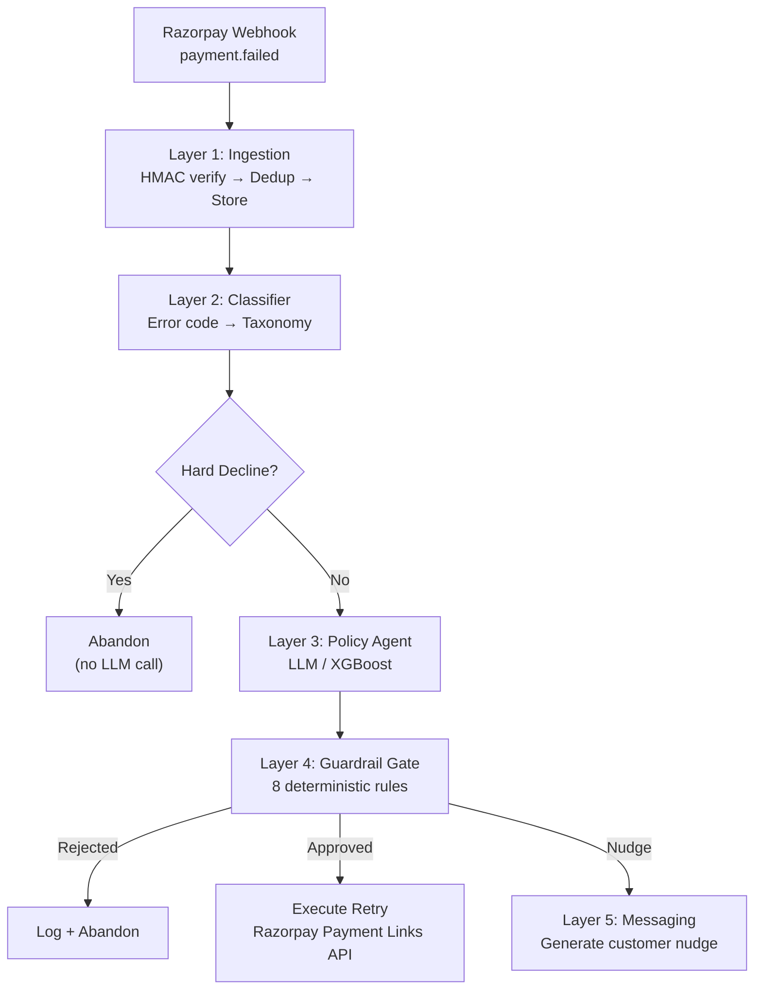

# 🔄 Payment Failure Recovery Engine

> AI-powered system that decides **whether**, **when**, and **on which rail** to retry a failed payment — with deterministic guardrails ensuring no LLM ever directly authorizes money movement.

Indian checkout success rates sit in the high 80s. Every failed payment is real, recoverable money. This system replaces dumb fixed-schedule retries with intelligent, context-aware recovery decisions — and **proves the improvement with numbers, not vibes.**

## 📊 Headline Result

```
Run: .venv/bin/python -m eval.runner --scenarios 5000 --seeds 5 --skip-llm
```

> **₹8.57L additional net revenue per ₹1Cr of failed volume vs. a fixed 3-retry
> baseline, at 13% fewer retry attempts and zero false retries.**

5,000 scenarios × 5 seeds (mean ± σ). These are the exact contents of
`eval/results/` — reproduce them with the command above.

| Policy | Recovery Rate | Retry Cost (avg) | False-Retry % | ₹ per ₹1Cr | Net ₹ per ₹1Cr |
|--------|-------------|-------------------|---------------|------------|----------------|
| No Retry | 0.0% | 0.00 | 0.0% | ₹0 | ₹0 |
| Fixed 3-Retry | 19.2% ± 0.7 | 2.73 ± 0.01 | 8.0% ± 0.3 | ₹18,49,489 | ₹17,95,744 |
| XGBoost/Rules | 27.4% ± 0.6 | 2.37 ± 0.01 | 0.0% ± 0.0 | ₹26,99,581 | ₹26,52,874 |
| LLM Agent | not yet run | — | — | — | — |

### Is that difference real?

Two overlapping ± ranges can't answer that, so the harness doesn't try. Every
policy runs under **common random numbers** — the same scenario draws the
identical random sequence no matter which policy is deciding — and outcomes are
differenced one-to-one, giving a confidence interval on the *difference*:

| vs. Fixed 3-Retry | Δ | 95% CI | n | Real? |
|---|---|---|---|---|
| Recovery rate | **+8.22pp** | [+7.77, +8.67] | 25,000 | **yes** |
| Retry attempts | **−0.357** | [−0.369, −0.346] | 25,000 | **yes** |

### Why net, and why you don't have to trust our cost number

Recovery rate alone makes brute force optimal by construction — if attempts are
free, "retry everything, always" wins. So the headline is **net of retry cost**,
defaulting to ₹2.00/attempt (`--retry-cost-inr` to change it).

That default is a floor: it prices gateway and ops cost only, not decline-ratio
penalties or customer goodwill, neither of which we can source honestly. So the
harness also reports the **break-even** — the retry cost at which the two
policies would tie. Here the agent recovers *more* while attempting *fewer*, so
it **dominates at any retry cost including ₹0**, and the assumption never has to
be argued.

### What the model assumes

The bank simulator is synthetic — stated plainly, because it's the number a
payments person will challenge first. Its central assumption: **a retry is not a
fresh payment.** The payment already failed for a reason, so the bank's baseline
approval rate says little; what matters is `P(the blocker cleared)`, which is
modelled per failure class in `eval/bank_profiles.py`. Blended baseline recovery
lands at 19.2%, inside the 15–30% band public figures report, and
`tests/test_calibration.py` fails if a change pushes it out.

**Remaining gap:** the LLM policy row is blank because it has not been run
end-to-end — not because it scored badly.

No number in this README was written by hand; every one comes from
`eval/runner.py`.

## 🏗️ Architecture

```
Layer 1: Ingestion          → Signature verify → Idempotency → Event store
Layer 2: Deterministic      → Error code → Failure taxonomy (NO LLM)
Layer 3: Policy Agent       → LLM/XGBoost → Constrained JSON action
Layer 4: Guardrail Gate     → Schema + Business rules → BEFORE execution
Layer 5: Recovery Messaging → Customer nudge (scoped LLM generation)
```



**Order matters:** Deterministic logic wraps the LLM on **both sides**. The model only ever chooses from a constrained action space and never executes anything directly.

## 🛡️ What Stops It From Doing Something Stupid With Real Money

This is the first question a fintech panel will ask. Here's the answer:

1. **Hard-decline blocklist** — Fraud blocks, stolen cards, and permanent declines are caught *before* the LLM is ever called. No agent involvement.
2. **Fixed action space** — The LLM outputs a JSON action from exactly 5 options: `retry_now`, `retry_at`, `switch_rail`, `nudge_customer`, `abandon`. No freeform.
3. **Schema validation** — Pydantic validates every agent output. Malformed JSON → auto-reject.
4. **8 business rules** — Max retries per payment (3), per customer per 24h (5), amount ceiling (₹50K), consent window (72h), nudge rate limit (2/day), time-of-day blackout (11PM-7AM), idempotency key requirement.
5. **Idempotency keys** — The key is deterministic (`retry_{payment_id}_{attempt_no}`) and
   `retry_attempts.idempotency_key` is UNIQUE. The orchestrator checks for an existing
   attempt *before* calling the Razorpay API, so a replayed webhook cannot produce a
   second payment link. Note the honest boundary: `razorpay-python` has no idempotency
   header, so this is enforced on our side, not the gateway's.
6. **No short-circuiting** — The guardrail checks ALL rules and reports ALL violations for audit.
7. **LLM fallback** — If the LLM fails, times out, or returns garbage, the system falls back to an XGBoost rule-based heuristic. Never blocks.

## 🚀 Quick Start

```bash
cp .env.example .env    # fill in your Razorpay test keys + LLM key
./run.sh
```

That is the whole thing. `run.sh` builds a clean isolated venv, installs
dependencies, creates the Postgres role and database if they don't exist, runs
`ruff` + `pytest` + `mypy --strict`, starts the API and the dashboard, and opens
a public tunnel — then prints the webhook URL to paste into Razorpay:

```
  API          http://127.0.0.1:8000
  API docs     http://127.0.0.1:8000/docs
  Dashboard    http://127.0.0.1:8501  (password from .env)
  Public URL   https://<random>.trycloudflare.com

  Paste this into the Razorpay dashboard → Settings → Webhooks:
    https://<random>.trycloudflare.com/webhooks/razorpay
```

It refuses to expose anything until the three checks pass, so a green public URL
means the build is actually clean. Ctrl-C stops everything.

**Two things are gated, because the tunnel is public:**

- **The dashboard** needs `DASHBOARD_PASSWORD`. Leave it blank and `run.sh`
  generates one into `.env` and prints it once. It reads live payment data, and
  Streamlit binds a port like anything else.
- **`/docs`, `/redoc` and `/openapi.json`** exist only when
  `APP_ENV=development` — they enumerate every route and schema. Set
  `APP_ENV=staging` and `API_KEY` to close them; `/openapi.json` then needs
  `X-API-Key`. `run.sh` warns if you leave them open under a live tunnel.

| | |
|---|---|
| `./run.sh --verify-only` | build + all three checks, start nothing (this is the CI command — needs no Postgres) |
| `./run.sh --no-tunnel` | run locally without a public URL |
| `PY=python3.12 ./run.sh` | pin the interpreter, when `python3` isn't the one with working wheels |

**Requirements:** Python ≥ 3.11, Postgres (`brew services start postgresql@15`
or `docker compose up -d postgres`), and `cloudflared` or `ngrok` for the public
URL. Everything else the script installs itself.

**On the venv:** the build is isolated on purpose — no `--system-site-packages`.
The script verifies this by checking that imports resolve to files *inside*
`.venv`, not merely that they import. A venv built with system site-packages
passes a plain `import fastapi` while owning nothing, so `pip freeze` writes a
lockfile of packages it doesn't have and a clean machine gets `ImportError` at
startup. If it finds such a venv it rebuilds it, and restores the old one if the
rebuild can't reach PyPI.

**On the lockfile:** the first successful build writes `requirements.lock.txt`
from what actually installed, and later builds install from it. Commit it — the
pins are then the exact versions the checks passed against, rather than guesses.

### With Docker Compose

```bash
cp .env.example .env    # fill in your keys, incl. POSTGRES_PASSWORD
docker compose up
```

Compose has no public tunnel and no verify step — it's the plain local stack.
Note it does **not** publish Postgres' port: the app reaches it over the compose
network, because binding 5432 to `0.0.0.0` would expose a database holding
customer emails, phone numbers and VPAs to the whole local network.

## 📈 Run the Eval Harness

```bash
# Fast mode — no API keys needed, uses XGBoost/rule-based policies
.venv/bin/python -m eval.runner --scenarios 5000 --seeds 5 --skip-llm

# Full mode — includes LLM policy (requires an LLM key in .env)
.venv/bin/python -m eval.runner --scenarios 5000 --seeds 5

# Train XGBoost baseline
.venv/bin/python scripts/train_xgboost.py --n-samples 10000

# Simulate webhooks against the running API
.venv/bin/python scripts/simulate_webhooks.py --count 20
```

## 📁 Project Structure

```
├── src/
│   ├── ingestion/        # Layer 1: Webhook endpoint + signature + dedup
│   ├── classifier/       # Layer 2: Error code → failure taxonomy
│   ├── agent/            # Layer 3: LLM policy agent + XGBoost baseline
│   ├── guardrail/        # Layer 4: Schema + business rule validation
│   ├── messaging/        # Layer 5: Customer nudge generation
│   ├── executor/         # Retry execution via Razorpay API
│   ├── orchestrator.py   # Ties all 5 layers together
│   └── main.py           # FastAPI app
├── eval/                 # Standalone eval harness
│   ├── simulator.py      # Bank-response simulator
│   ├── scenario_generator.py
│   ├── policies/         # No-retry, fixed-retry, XGBoost, LLM
│   └── runner.py         # Runs all policies, produces results table
├── dashboard/            # Streamlit dashboard
├── tests/                # Pytest test suite
├── scripts/              # Utility scripts
├── run.sh                # One command: clean build → verify → run → public URL
└── docs/                 # Architecture, failure cases, eval methodology
```

## ⚠️ Documented Failure Cases

See [docs/failure_cases.md](docs/failure_cases.md) for the full list. Summary:

| # | Failure Case | System Response |
|---|-------------|-----------------|
| 1 | LLM hallucination | Guardrail rejects, falls back to abandon |
| 2 | Bank API timeout | Deterministic key + pre-execute check prevents duplicate link |
| 3 | Consent window expired | Guardrail rejects retry after 72h |
| 4 | Rate limit exhaustion | Abandon silently, log for review |
| 5 | Cascade failure | Max retry cap prevents infinite loop |
| 6 | LLM provider outage | XGBoost fallback (degradation not yet measured) |
| 7 | Simulator vs reality | Stated as known limitation |

## 🔧 Tech Stack

- **Python 3.11+** / FastAPI / SQLAlchemy (async)
- **PostgreSQL** — events, failures, retries, ledger
- **Claude / GPT** — policy agent + nudge generation
- **XGBoost** — ML baseline for comparison
- **Streamlit + Plotly** — dashboard
- **Razorpay API** — test-mode webhooks + Payment Links
