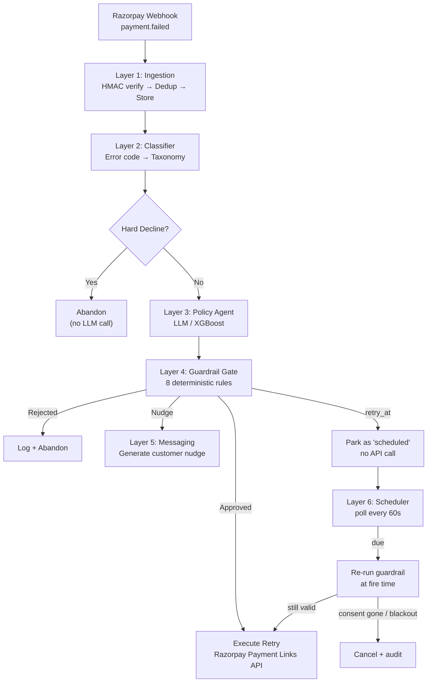

# 🔄 Payment Failure Recovery Engine

> AI-powered system that decides **whether**, **when**, and **on which rail** to retry a failed payment — with deterministic guardrails ensuring no LLM ever directly authorizes money movement.

Indian checkout success rates sit in the high 80s. Every failed payment is real, recoverable money. This system replaces dumb fixed-schedule retries with intelligent, context-aware recovery decisions — and **proves the improvement with numbers, not vibes.**

## 📊 Headline Result

```
Run: .venv/bin/python -m eval.runner --scenarios 5000 --seeds 5 --skip-llm
```

> **₹11.70L additional net revenue per ₹1Cr of failed volume vs. a fixed 3-retry
> baseline, at 15% fewer retry attempts and zero false retries.**

5,000 scenarios × 5 seeds (mean ± σ). These are the exact contents of
`eval/results/` — reproduce them with the command above.

| Policy | Recovery Rate | Retry Cost (avg) | False-Retry % | ₹ per ₹1Cr | Net ₹ per ₹1Cr |
|--------|-------------|-------------------|---------------|------------|----------------|
| No Retry | 0.0% | 0.00 | 0.0% | ₹0 | ₹0 |
| Fixed 3-Retry | 19.2% ± 0.7 | 2.73 ± 0.01 | 8.0% ± 0.3 | ₹18,49,489 | ₹17,95,744 |
| XGBoost | 30.2% ± 0.5 | 2.32 ± 0.00 | 0.0% ± 0.0 | ₹30,11,921 | ₹29,66,234 |
| LLM Agent | blocked — see below | — | — | — | — |

**This row moved.** It previously read 27.4% and was labelled "XGBoost/Rules",
because `XGBoostPolicy.decide()` loaded a trained model into `self._model` and
then never referenced it — every decision took the rule branch, and no
production call site passed a model path at all. The model is consulted now
(`scripts/train_xgboost.py` builds it, `run.sh` trains one if missing), and it
disagrees with the rules often enough to be worth 2.8pp.

### Is that difference real?

Two overlapping ± ranges can't answer that, so the harness doesn't try. Every
policy runs under **common random numbers** — the same scenario draws the
identical random sequence no matter which policy is deciding — and outcomes are
differenced one-to-one, giving a confidence interval on the *difference*:

| vs. Fixed 3-Retry | Δ | 95% CI | n | Real? |
|---|---|---|---|---|
| Recovery rate | **+11.03pp** | [+10.54, +11.52] | 25,000 | **yes** |
| Retry attempts | **−0.409** | [−0.421, −0.397] | 25,000 | **yes** |

### Why net, and why you don't have to trust our cost number

Recovery rate alone makes brute force optimal by construction — if attempts are
free, "retry everything, always" wins. So the headline is **net of retry cost**,
defaulting to ₹2.00/attempt (`--retry-cost-inr` to change it).

That default is a floor: it prices gateway and ops cost only, not decline-ratio
penalties or customer goodwill, neither of which we can source honestly. So the
harness also reports the **break-even** — the retry cost at which the two
policies would tie. Here the agent recovers *more* while attempting *fewer*, so
it **dominates at any retry cost including ₹0**, and the assumption never has to
be argued.

### What the model assumes

The bank simulator is synthetic — stated plainly, because it's the number a
payments person will challenge first. Its central assumption: **a retry is not a
fresh payment.** The payment already failed for a reason, so the bank's baseline
approval rate says little; what matters is `P(the blocker cleared)`, which is
modelled per failure class in `eval/bank_profiles.py`. Blended baseline recovery
lands at 19.2%, inside the 15–30% band public figures report, and
`tests/test_calibration.py` fails if a change pushes it out.

**Remaining gap:** the LLM policy row is blank because the configured provider
returns HTTP 402 — the OpenRouter key in `.env` is on an account with no
credits. It is not blank because the policy scored badly.

The harness refuses to fill it in dishonestly. `PolicyAgent.decide()` swallows
LLM errors and returns a heuristic action, so a dead provider would otherwise
produce a full, plausible LLM row made entirely of XGBoost fallbacks. The runner
counts those (`fallback_count`) and **drops the row** when they dominate:

```
Dropping the LLM Agent row: 100.0% of its decisions came from the XGBoost
fallback, so it does not measure the LLM.
```

Add credits, or point `LLM_PROVIDER`/`ANTHROPIC_API_KEY` at a working account,
and re-run without `--skip-llm`.

**On the XGBoost model's near-perfect held-out score:** the training labels are
the argmax of the simulator's own expected-value calculation, which is a
deterministic function of the same features. A tree fits that closely, so ~0.99
means "it learned the simulator", not "this is a hard prediction problem". It is
still a genuine baseline — it encodes bank/hour/blocker-clearing structure the
rule heuristic does not — but the score is not evidence of difficulty.

No number in this README was written by hand; every one comes from
`eval/runner.py`.

## 🏗️ Architecture

```
Layer 1: Ingestion          → Signature verify → Idempotency → Event store
Layer 2: Deterministic      → Error code → Failure taxonomy (NO LLM)
Layer 3: Policy Agent       → LLM/XGBoost → Constrained JSON action
Layer 4: Guardrail Gate     → Schema + Business rules → BEFORE execution
Layer 5: Recovery Messaging → Customer nudge (scoped LLM generation)
Layer 6: Scheduler          → Fires deferred retries, reconciles dropped events
```



**`retry_at` is the branch worth reading twice.** The executor maps `retry_at`
onto the same `_create_payment_link` call as `retry_now`, so before Layer 6
existed, "retry in 4 hours" created the link *immediately* and
`retry_attempts.scheduled_at` was written and read by nothing. A guardrail that
approves "not yet" in front of a system that does it now is worse than having no
timing at all, because the audit trail then records a delay that never happened.

**Order matters:** Deterministic logic wraps the LLM on **both sides**. The model only ever chooses from a constrained action space and never executes anything directly.

## 🛡️ What Stops It From Doing Something Stupid With Real Money

This is the first question a fintech panel will ask. Here's the answer:

1. **Hard-decline blocklist** — Fraud blocks, stolen cards, and permanent declines are caught *before* the LLM is ever called. No agent involvement.
2. **Fixed action space** — The LLM outputs a JSON action from exactly 5 options: `retry_now`, `retry_at`, `switch_rail`, `nudge_customer`, `abandon`. No freeform.
3. **Schema validation** — Pydantic validates every agent output. Malformed JSON → auto-reject.
4. **8 business rules** — Max retries per payment (3), per customer per 24h (5), amount ceiling (₹50K), consent window (72h), nudge rate limit (2/day), time-of-day blackout (11PM-7AM), idempotency key requirement.
5. **Idempotency keys** — The key is deterministic (`retry_{payment_id}_{attempt_no}`) and
   `retry_attempts.idempotency_key` is UNIQUE. The orchestrator checks for an existing
   attempt *before* calling the Razorpay API, so a replayed webhook cannot produce a
   second payment link. Note the honest boundary: `razorpay-python` has no idempotency
   header, so this is enforced on our side, not the gateway's.
6. **No short-circuiting** — The guardrail checks ALL rules and reports ALL violations for audit.
7. **LLM fallback** — If the LLM fails, times out, or returns garbage, the system falls back to XGBoost. Never blocks — and `fallback_count` makes the degradation countable, so a dead provider can never be reported as an LLM result.
8. **Deferred retries re-validate at fire time** — A `retry_at` decision outlives its own guardrail check by hours. When the scheduler fires it, the case state, the consent status and the time-of-day blackout are all re-read; a customer who opted out at 23:00 does not get the 02:00 retry that was approved at 22:00.
9. **The idempotency race fails closed** — Two webhooks for one payment can both derive the same key before either commits. The UNIQUE constraint on `retry_attempts.idempotency_key` breaks the tie *before* the Razorpay call, and the loser exits as a clean skip rather than an unhandled exception.

## 🚀 Quick Start

```bash
cp .env.example .env    # fill in your Razorpay test keys + LLM key
./run.sh
```

That is the whole thing. `run.sh` builds a clean isolated venv, installs
dependencies, creates the Postgres role and database if they don't exist, runs
`ruff` + `pytest` + `mypy --strict`, starts the API and the dashboard, and opens
a public tunnel — then prints the webhook URL to paste into Razorpay:

```
  API          http://127.0.0.1:8000
  API docs     http://127.0.0.1:8000/docs
  Dashboard    http://127.0.0.1:8501  (password from .env)
  Public URL   https://<random>.trycloudflare.com

  Paste this into the Razorpay dashboard → Settings → Webhooks:
    https://<random>.trycloudflare.com/webhooks/razorpay
```

It refuses to expose anything until the three checks pass, so a green public URL
means the build is actually clean. Ctrl-C stops everything.

**Two things are gated, because the tunnel is public:**

- **The dashboard** needs `DASHBOARD_PASSWORD`. Leave it blank and `run.sh`
  generates one into `.env` and prints it once. It reads live payment data, and
  Streamlit binds a port like anything else.
- **`/docs`, `/redoc` and `/openapi.json`** exist only when
  `APP_ENV=development` — they enumerate every route and schema. Set
  `APP_ENV=staging` and `API_KEY` to close them; `/openapi.json` then needs
  `X-API-Key`. `run.sh` warns if you leave them open under a live tunnel.

| | |
|---|---|
| `./run.sh --verify-only` | build + all three checks, start nothing (needs no Postgres) |
| `./run.sh --no-tunnel` | run locally without a public URL |
| `PY=python3.12 ./run.sh` | pin the interpreter, when `python3` isn't the one with working wheels |

### CI

`.github/workflows/ci.yml` runs `ruff` + `mypy --strict` + `pytest` on Python
3.11 and 3.13 (the floor `pyproject.toml` claims and the ceiling it is developed
on), applies every Alembic migration over a `create_all` schema to catch the
drift `create_all` hides, and separately trains the model and runs the eval
harness so the numbers above cannot quietly stop reproducing. No database
service: `tests/conftest.py` builds the real schema over a throwaway SQLite
file, which is the same reason `--verify-only` needs no Postgres.

**Requirements:** Python ≥ 3.11, Postgres (`brew services start postgresql@15`
or `docker compose up -d postgres`), and `cloudflared` or `ngrok` for the public
URL. Everything else the script installs itself.

**On the venv:** the build is isolated on purpose — no `--system-site-packages`.
The script verifies this by checking that imports resolve to files *inside*
`.venv`, not merely that they import. A venv built with system site-packages
passes a plain `import fastapi` while owning nothing, so `pip freeze` writes a
lockfile of packages it doesn't have and a clean machine gets `ImportError` at
startup. If it finds such a venv it rebuilds it, and restores the old one if the
rebuild can't reach PyPI.

**On the lockfile:** the first successful build writes `requirements.lock.txt`
from what actually installed, and later builds install from it. Commit it — the
pins are then the exact versions the checks passed against, rather than guesses.

### With Docker Compose

```bash
cp .env.example .env    # fill in your keys, incl. POSTGRES_PASSWORD
docker compose up
```

Compose has no public tunnel and no verify step — it's the plain local stack.
Note it does **not** publish Postgres' port: the app reaches it over the compose
network, because binding 5432 to `0.0.0.0` would expose a database holding
customer emails, phone numbers and VPAs to the whole local network.

## 🗄️ Schema and Migrations

`init_db()` calls `create_all(checkfirst=True)`, which creates missing *tables*
and silently ignores missing *columns* — fine for a fresh developer database,
useless as an upgrade path for one holding payment records. Alembic is the
upgrade path:

```bash
.venv/bin/alembic upgrade head
```

Every step is guarded by an inspector check, so it is a no-op on a database
`create_all` already brought up to date and applies the delta on one that
predates it. A migration that crashes half the time is a migration nobody runs.

| Revision | What it adds |
|---|---|
| `0000_initial_schema` | The baseline tables. Added because 0001/0002 only *alter* them — `upgrade head` on an empty database used to succeed and leave you with `recovery_cases` and no `retry_attempts` |
| `0001_recovery_cases` | `recovery_cases`, the attribution join keys, consent columns |
| `0002_revenue_recovery` | `promises_to_pay`, `case_events`, case scheduling, and **drops NOT NULL on `retry_attempts.payment_failure_id`/`payment_id`** — the constraint that confined the engine to the payment rail |

See [docs/architecture.md](docs/architecture.md) for the full ER diagram.

## 🚢 Deploy

```bash
docker compose -f docker-compose.prod.yml up -d --build   # any box you own
```

Or on Render: **New → Blueprint**, point it at this repo, and
[render.yaml](render.yaml) provisions Postgres, the API and the dashboard. Set
the six secrets it marks `sync: false` in the dashboard; `API_KEY` is generated.

**Serverless will not work.** Layer 6 is an in-process asyncio loop, and Vercel
/ Lambda kill the process between requests — deferred retries would never fire.
This needs a container that stays resident. On Render's *free* plan the service
also sleeps after ~15 minutes idle, which has the same effect until something
wakes it; [render.yaml](render.yaml) explains the consequences in full.

Three things the deployment does differently from `docker compose up`:

| | Dev | Deployed |
|---|---|---|
| Schema | `create_all()` at startup | `alembic upgrade head` in the entrypoint |
| Source | bind-mounted, `--reload` | baked into the image |
| Model | trained by `run.sh` if absent | trained into the image at build time |

`create_all` is gated to `APP_ENV=development` in [src/main.py](src/main.py) —
it creates missing *tables* and silently ignores missing *columns*, so on a
database that predates a model change it "succeeds" and then fails on the first
write to the money path. `docker-entrypoint.sh` runs migrations before uvicorn
on every boot; they are inspector-guarded, so repeat boots are no-ops.

`DATABASE_URL` and `DATABASE_URL_SYNC` can both be pointed at the same
platform-injected connection string — [src/config.py](src/config.py) normalises
each to the driver it needs, including Heroku's legacy `postgres://` scheme.

**Point Razorpay at it:** Settings → Webhooks → `https://<your-host>/webhooks/razorpay`,
with the same secret you set as `RAZORPAY_WEBHOOK_SECRET`.

## 📈 Run the Eval Harness

```bash
# Fast mode — no API keys needed, uses XGBoost/rule-based policies
.venv/bin/python -m eval.runner --scenarios 5000 --seeds 5 --skip-llm

# Check the LLM works BEFORE spending quota — lists models, makes 5 real
# decisions, reports the fallback rate. A model that cannot hold the JSON
# contract shows up here in 5 calls instead of 2,700.
.venv/bin/python scripts/check_llm.py

# Full mode — includes LLM policy (requires a working LLM key in .env).
# Call volume is scenarios x 3 attempts x seeds: 300x3 = 2,700, 5000x5 = 75,000.
.venv/bin/python -m eval.runner --scenarios 300 --seeds 3

# Train the XGBoost baseline (run.sh does this automatically if no model exists)
.venv/bin/python scripts/train_xgboost.py --n-samples 10000

# Simulate webhooks against the running API
.venv/bin/python scripts/simulate_webhooks.py --count 20
```

## 📁 Project Structure

```
├── src/
│   ├── ingestion/        # Layer 1: Webhook endpoint + signature + dedup
│   ├── classifier/       # Layer 2: Error code → failure taxonomy
│   ├── agent/            # Layer 3: LLM policy agent + XGBoost baseline
│   ├── guardrail/        # Layer 4: Schema + business rule validation
│   ├── messaging/        # Layer 5: Customer nudge generation
│   ├── executor/         # Retry execution via Razorpay API
│   ├── cases.py          # Recovery cases, promises to pay, audit trail
│   ├── scheduler.py      # Layer 6: deferred retries, event reconciliation
│   ├── orchestrator.py   # Ties the layers together
│   └── main.py           # FastAPI app
├── eval/                 # Standalone eval harness
│   ├── simulator.py      # Bank-response simulator
│   ├── scenario_generator.py
│   ├── policies/         # No-retry, fixed-retry, XGBoost, LLM
│   └── runner.py         # Runs all policies, produces results table
├── dashboard/            # Streamlit dashboard
├── tests/                # Pytest test suite
├── scripts/              # Utility scripts
├── alembic/versions/     # Schema migrations (create_all is not an upgrade path)
├── models/               # Trained XGBoost artefact (gitignored; run.sh builds it)
├── .github/workflows/    # CI: ruff + mypy + pytest on 3.11 and 3.13, migrations, eval
├── run.sh                # One command: clean build → verify → run → public URL
└── docs/                 # Architecture, failure cases, eval methodology
```

## ⚠️ Documented Failure Cases

See [docs/failure_cases.md](docs/failure_cases.md) for the full list. Summary:

| # | Failure Case | System Response |
|---|-------------|-----------------|
| 1 | LLM hallucination | Guardrail rejects, falls back to abandon |
| 2 | Bank API timeout | Deterministic key + pre-execute check prevents duplicate link |
| 3 | Consent window expired | Guardrail rejects retry after 72h |
| 4 | Rate limit exhaustion | Abandon silently, log for review |
| 5 | Cascade failure | Max retry cap prevents infinite loop |
| 6 | LLM provider outage | XGBoost fallback; `fallback_count` makes it countable and the eval drops the row rather than reporting it |
| 7 | Simulator vs reality | Stated as known limitation |
| 8 | Process dies before a BackgroundTask runs | `reconcile_events()` re-runs events left `processed=False` past a threshold — Razorpay will not re-send after our 200 |
| 9 | Consent withdrawn during a deferred wait | Re-validated at fire time; the scheduled retry is cancelled and audited |
| 10 | Two webhooks race the same idempotency key | UNIQUE constraint decides before the API call; loser skips cleanly |

## 🔧 Tech Stack

- **Python 3.11+** / FastAPI / SQLAlchemy (async)
- **PostgreSQL** — events, failures, retries, ledger
- **Claude / GPT** — policy agent + nudge generation
- **XGBoost** — ML baseline for comparison
- **Streamlit + Plotly** — dashboard
- **Razorpay API** — test-mode webhooks + Payment Links
- **asyncio** — the Layer 6 scheduler runs in-process; no broker, no second deployment. Swap in a real queue when there is more than one app process.

## ✅ Test Coverage

179 tests, 82% statement coverage over `src/`. The money paths are where the
coverage went:

| Module | Coverage | Why it is covered |
|---|---|---|
| `cases.py` | 97% | Attribution, stopping rules, promises |
| `ingestion/idempotency.py` | 82% | The double-charge guard, including the constraint race |
| `ingestion/router.py` | 80% | Webhook entry point + capture attribution |
| `agent/xgboost_baseline.py` | 83% | Includes "the model actually loads" |
| `orchestrator.py` | 76% | Write-ahead ordering, guardrail rejection |
| `scheduler.py` | 69% | Deferred fire, re-validation, event reconciliation |

`dashboard/` is 0% — the pages are Streamlit scripts whose bodies execute on
import. `dashboard/auth.py` is the exception, split out precisely so the password
gate is testable without a Streamlit runtime.
