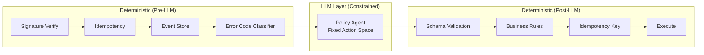
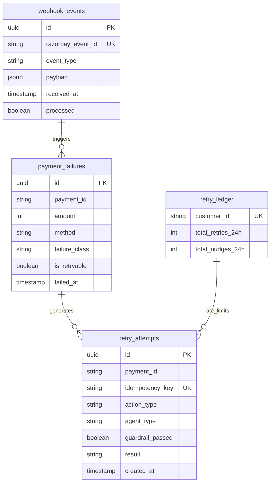

# Architecture

## Design Principle: Deterministic → LLM → Deterministic

The LLM is sandwiched between two deterministic layers. This is the single most important architectural decision and the first thing a fintech panel will evaluate.

**Why this order?**
- Pre-LLM determinism handles what a regex can solve. Calling an LLM to classify `insufficient_funds` from a structured error code is wasteful and fragile.
- Post-LLM determinism is the safety net. The LLM can hallucinate, but the guardrail catches it before any money moves.

## Database Schema

## Latency Budget

| Stage | Target | Notes |
|-------|--------|-------|
| Signature verification | <1ms | HMAC-SHA256 |
| Idempotency check | <5ms | DB lookup with index |
| Classification | <1ms | In-memory YAML lookup |
| LLM policy agent | <3s | Anthropic API call |
| Guardrail validation | <1ms | Pure Python rule checks |
| Nudge generation | <3s | LLM call with 3s timeout |
| Razorpay API call | <2s | Payment Link creation |
| **Total** | **<10s** | Async — webhook returns 200 immediately |

The webhook endpoint returns 200 OK in <10ms. All processing happens asynchronously in a background task.
