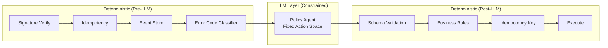
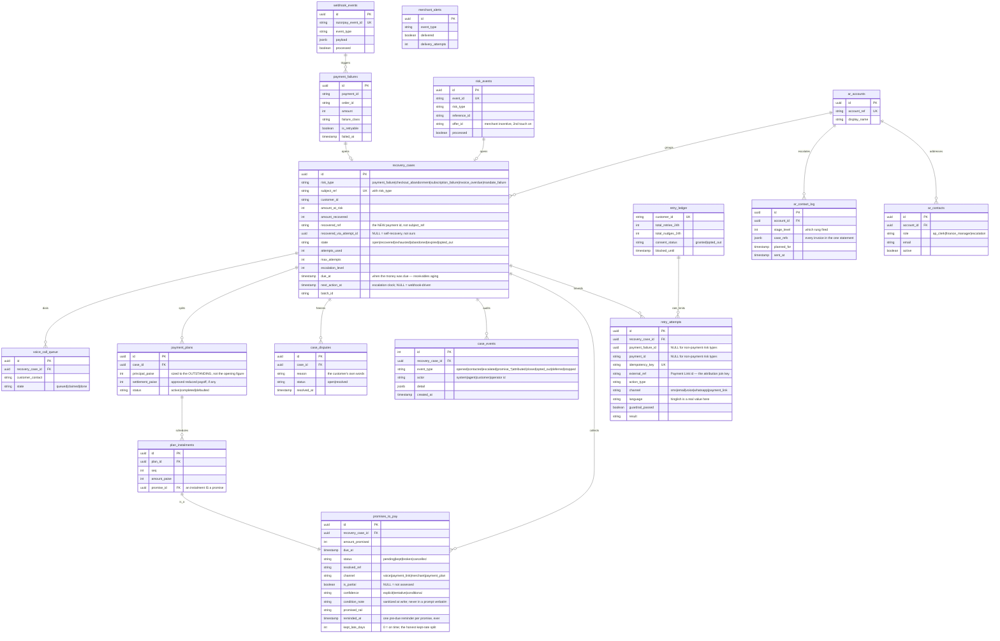

# Architecture

## Design Principle: Deterministic → LLM → Deterministic

The LLM is sandwiched between two deterministic layers. This is the single most important architectural decision and the first thing a fintech panel will evaluate.

**Why this order?**
- Pre-LLM determinism handles what a regex can solve. Calling an LLM to classify `insufficient_funds` from a structured error code is wasteful and fragile.
- Post-LLM determinism is the safety net. The LLM can hallucinate, but the guardrail catches it before any money moves.

## Database Schema

`recovery_cases` is the centre, not `payment_failures`. A failed card charge, an
abandoned cart, a halted subscription, an overdue invoice and a dead mandate are
all money we might get back; they differ only in how they were detected, so they
share one case table, one attempt budget, one terminal state and one
recovered-amount column rather than five parallel pipelines. `risk_type` says
which source, `subject_ref` identifies it in that source's namespace.

The payment-rail tables hang off that as detail records — which is why
`retry_attempts.payment_failure_id` and `.payment_id` are nullable. An invoice
chase has no payment behind it.

**Two joins carry the design.** `plan_instalments.promise_id` is why a payment
plan needed no new state machine: an instalment IS a `promises_to_pay` row, so
the pause, the audit event and the break-on-miss all come free from the promise
sweep. And `ar_contact_log.case_refs` is a JSON array rather than a foreign key
because the row records **one contact covering many invoices** — the
consolidation guarantee is in the shape of the table.

### The three stopping rules, and where each lives

| Rule | Column | Enforced by |
|---|---|---|
| Attempt budget spent | `recovery_cases.attempts_used / max_attempts` | `stop_reason()` |
| Consent withdrawn | `retry_ledger.consent_status` | `stop_reason()`, never expires |
| Contact not yet due | `recovery_cases.next_action_at` | `stop_reason()`, expires on its own |

`next_action_at` is written by two things: the escalation backoff in
`attach_attempt()` (24h × escalation level, so the gap widens per rung) and a
promise to pay, which takes the *later* of the promise date and whatever the
ladder had already scheduled. A promise is permission to wait, not permission
to contact sooner.

A promise breaks on the clock plus a grace window (`PROMISE_GRACE_HOURS`,
default 24h) — a payment initiated on the due date can post a day late, and
breaking a kept promise is the one lie this ledger must never tell. Inside
grace, a capture keeps the promise with `kept_late_days` recording how late.

Promises are captured from three surfaces — the Hinglish voice agent (dates
resolved by a deterministic lexicon, never the LLM), the recovery page's
"promise a date" form, and `POST /risks/{type}/{ref}/promise` for merchants
who collected one on their own calls. All three enforce the horizon cap
(`PROMISE_MAX_HORIZON_DAYS`, 14 — kept rate decays with length) and the
per-case promise cap (`MAX_PROMISES_PER_CASE`, 3 — words that stopped
predicting money must not park a case forever; payment-plan instalments are
exempt as a validated set). The 48h pre-due reminder is sweep #9 in the
scheduler and spends a real contact slot through the chase pipeline — a
promise buys silence for the chase, never a free lane to remind from.

A broken promise pulls `next_action_at` back to *now* rather than NULL —
`due_cases()` skips NULL because NULL means "a webhook is this case's trigger",
so clearing it would release the case into a queue nothing reads.

## Latency Budget

| Stage | Target | Notes |
|-------|--------|-------|
| Signature verification | <1ms | HMAC-SHA256 |
| Idempotency check | <5ms | DB lookup with index |
| Classification | <1ms | In-memory YAML lookup |
| LLM policy agent | <3s | Anthropic API call |
| Guardrail validation | <1ms | Pure Python rule checks |
| Nudge generation | <3s | LLM call with 3s timeout |
| Razorpay API call | <2s | Payment Link creation |
| **Total** | **<10s** | Async — webhook returns 200 immediately |

The webhook endpoint returns 200 OK in <10ms. All processing happens asynchronously in a background task.
